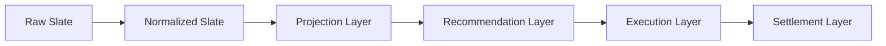

# IMMUTABLE_PIPELINE.md

Phase 3 — eliminating in-place mutation, incrementally.

**Mission reminder:** this phase is not about betting performance. No
probability, projection, Rule 71/81, bankroll sizing, calibration,
portfolio, execution, or ledger logic was changed. Production behavior
is identical before and after every commit in this phase — proven by
regression tests, not assumed.

---

## 1. Background

Phase 2's audit (`docs/MODEL_V2_ARCHITECTURE.md` §7) found that
`data/slate.json` is mutated in place by **ten** different scripts across
a single `fetch-slate.yml` run, with no schema boundary or immutable
checkpoint between any of them. This makes it impossible to inspect what
any one stage actually changed without diffing the whole file, and it's
the root cause of an entire class of bug (a later stage silently
assuming an earlier stage's output shape, as in the Phase 1 incident).

This phase does not eliminate that in one pass — the mission brief is
explicit: *"Do NOT rewrite the repository all at once. Introduce the
architecture incrementally. Maintain backwards compatibility wherever
practical. Prefer adapters over breaking changes."* What follows is what
was actually done, chosen specifically to be the safest available
incremental step, not the most complete one.

---

## 2. Target pipeline

Mapped onto the actual scripts in this repository:

| Layer | Scripts (current pipeline order) | Status this phase |
|---|---|---|
| **Raw Slate** | `api/slate.js` fetch → initial `data/slate.json` write | Unchanged — this is the input, not a mutator |
| **Normalized Slate** | `fetch_lineups.py` → `enrich_lineup_confirmed.py` → `post_fetch_gate.py` → `fetch_savant_pitchers.py` → `merge_odds.py` → `enrich_data.py` | **One script (`enrich_lineup_confirmed.py`) converted to immutable transform. One boundary artifact added** (`enrich_data.py` → `normalized_slate.json`, since it's the last step in this layer). Four scripts remain mutating. |
| **Projection Layer** | Embedded in `enrich_data.py` (offense baseline) and the start of `build_market_ledger.py` (`compute_projections`) | Not separated into its own artifact this phase — projections and recommendations are still computed and written together by `build_market_ledger.py`. Documented as future work (§6). |
| **Recommendation Layer** | `build_market_ledger.py` (populates `marketLedger`) | **One boundary artifact added** (`recommendations.json`). The script's internal evaluation logic (`evaluate_game()`) is untouched — far too large and load-bearing to safely refactor this phase. |
| **Execution Layer** | `protect_slate.py` → `risk_gate.py` → `write_pending_bets.py` → `validate_bet_logging.py` → `write_tracked_tickers.py` → `capture_closing_lines.py` | Untouched this phase — `risk_gate.py`'s in-place TT-downgrade mutation and `protect_slate.py`'s whole-file routing are both higher-risk, more central to real-money decisions, and were explicitly out of scope per the mission ("do not change... execution decisions"). |
| **Settlement Layer** | `clv_update.py` (root, separate `clv-update.yml` workflow) | Untouched — separate workflow, separate concern, not part of this pass. |

---

## 3. Artifact ownership map (this phase)

| Artifact | Path | Owner (writer) | Content | Status |
|---|---|---|---|---|
| Normalized Slate | `data/pipeline/<date>/normalized_slate.json` | `scripts/enrich_data.py` | Full slate object exactly as written to `data/slate.json` at that point in the pipeline | **New this phase** |
| Recommendations | `data/pipeline/<date>/recommendations.json` | `scripts/build_market_ledger.py` | Full slate object (including populated `marketLedger` per game) exactly as written to `data/slate.json` at that point | **New this phase** |
| Legacy working slate | `data/slate.json` | Still all ten scripts from Phase 2's audit | Unchanged in every way | Untouched |
| Authoritative slate | `data/slates/<date>/authoritative.json` | `protect_slate.py` (via `lib/slate_manager.py`) | Unchanged | Untouched — already its own immutable-ish artifact per Phase 2's findings, just not built on the same primitive introduced here |

Both new artifacts are written via the single shared primitive,
`lib/pipeline_artifacts.write_stage_artifact(stage, date, data)`
(`lib/pipeline_artifacts.py`), so any future stage that wants to publish
its own immutable checkpoint uses the same call, the same path
convention (`data/pipeline/<date>/<stage>.json`), and the same
try/except-wrapped, non-fatal safety posture.

**Why "full slate object" rather than a narrower per-stage schema?**
Because these are snapshots of `data/slate.json` at a point in time, not
yet a redesigned narrower contract — that's the schema-materialization
work `docs/CANONICAL_SCHEMAS.md` (Phase 2) already scoped as a separate,
larger, Phase 4 effort. This phase's artifacts prove the plumbing works
and give real inspectable checkpoints; narrowing their shape to just the
fields each layer actually owns is future work, not done here.

---

## 4. Scripts converted to immutable outputs

**One full conversion:** `scripts/enrich_lineup_confirmed.py`.

The per-game field computation (`lineupConfirmed`, `lineupSource`,
`lineupStatus`, `lineupCheckedAt`, `lineupAuditUsed`) was extracted,
unchanged, into a pure function `compute_game_lineup_fields(g, ...)` that
takes a game dict and returns new field values without reading from or
writing to `g`. `enrich_games_immutable(games, ...)` builds a **new**
list of game dicts (`{**g, **fields}` per game) instead of mutating each
game in the loop, and `main()` assembles a **new** slate object
(`{**slate, 'games': new_games}`) instead of mutating the loaded one.
The script still writes to the same `data/slate.json` path — the change
is entirely about *how* the new content is built, not *what* gets
written or *where*.

Chosen first because: it was the smallest of the ten confirmed mutators,
had a single well-isolated responsibility, and already had direct
existing test coverage (`tests/test_lineup_gate.py`,
`tests/test_phase1_lineup_fields.py`) to lean on as an independent
correctness check beyond this phase's own new tests.

**Two additive artifact snapshots (not full conversions):**
`scripts/enrich_data.py` and `scripts/build_market_ledger.py` — see §3.
Their internal mutation logic is untouched; they now also publish an
immutable copy of their output as a side effect.

---

## 5. Remaining mutable scripts

The other **eight** of the ten confirmed `data/slate.json` mutators are
unchanged this phase, each mapped to its layer above:

| Script | Layer | Why not converted this phase |
|---|---|---|
| `fetch_lineups.py` | Normalized Slate | External API calls (MLB boxscore) intertwined with the mutation — higher risk to extract cleanly in one pass |
| `post_fetch_gate.py` | Normalized Slate (quarantine) | Tightly coupled to `sys.exit()` control flow for the workflow's hard-fail gate; converting it changes how failure propagates, not just how data flows |
| `fetch_savant_pitchers.py` | Normalized Slate | External API calls; lower priority than the two enrichment scripts already handled |
| `merge_odds.py` | Normalized Slate | Not organized as a callable `main()` — a top-level script like `enrich_data.py`, but its odds-injection logic is denser and higher-stakes (feeds every market's pricing); deferred rather than risked in this pass |
| `validate_slate_final.py` | Recommendation Layer (execution-slip patch) | Patches `data/slate.json` as a secondary, best-effort side effect of building the execution slip — lower priority than the core `build_market_ledger.py` boundary already added |
| `protect_slate.py` | Execution Layer | Already implements its own artifact-routing state machine (`official_*`/`recheck_*`/`rejected_contaminated_*`/`authoritative.json`) via `lib/slate_manager.py` — arguably already "immutable-adjacent" in its own way; redesigning it is a larger, separate effort, not a candidate for this incremental pass |
| `risk_gate.py` | Execution Layer | Directly implements portfolio/TT-downgrade decisions — explicitly protected by the mission's "do not change... portfolio logic, execution decisions" |
| `write_pending_bets.py` | Execution Layer (reads only — does not write `data/slate.json`, listed for completeness since it's part of the same execution chain) | N/A — not a mutator of `data/slate.json`, included in Phase 2's list only as a boundary reference |

None of these were touched. Converting any of them is real future work,
sequenced in §7.

---

## 6. What was intentionally NOT done this phase

Per the mission's explicit "DO NOT" list:

- No ledger reconciliation (`data/bets.json` vs. root `bets.json` — that's Phase 2's own recommendation, untouched).
- No probability/projection redesign.
- No consolidation of the duplicate-logic findings from Phase 2's
  `docs/DUPLICATE_LOGIC_INVENTORY.md` beyond what was already done in
  that phase.
- No removal of any duplicate implementation as part of this refactor —
  the two scripts converted/instrumented this phase had no duplicate-logic
  findings against them in Phase 2's inventory, so this consideration
  didn't arise, but is noted here for completeness.
- No separation of the Projection Layer from the Recommendation Layer —
  both still happen inside/around `build_market_ledger.py`. Splitting them
  is real value (it would let you inspect "what did the model think"
  independent of "what did we recommend"), but requires understanding
  `evaluate_game()`'s ~1250 lines well enough to split it safely — not
  attempted here.

---

## 7. Recommended Phase 4 sequencing

1. Convert `merge_odds.py` to the immutable pattern (same technique as
   `enrich_lineup_confirmed.py`) — the next-safest candidate, since its
   transform is mechanical (structural odds injection) even though it's
   not yet organized as a callable function.
2. Split `build_market_ledger.py`'s projection computation from its
   recommendation/edge computation into two artifacts
   (`projections.json` / `recommendations.json`), now that the
   `recommendations.json` boundary already exists to build on top of.
3. Convert `fetch_lineups.py` and `fetch_savant_pitchers.py` — these need
   their external-API-call side effects separated from their pure
   data-shaping logic first (a small refactor in its own right) before
   the immutable-transform pattern can apply cleanly.
4. Only after 1–3: consider whether `risk_gate.py`'s portfolio decision
   logic can be expressed as a pure function of the Recommendation Layer
   artifact — this is the highest-value but also highest-risk conversion
   candidate, since it directly touches execution decisions, and should
   not be attempted until the lower-risk stages have proven the pattern
   out in production.
5. Revisit `protect_slate.py` / `lib/slate_manager.py`'s existing
   artifact-routing design and decide whether to unify it onto
   `lib/pipeline_artifacts.py`'s simpler primitive, or keep its own
   richer (official/recheck/rejected) versioning scheme as the more
   appropriate model for the authoritative slate specifically.

---

## 8. Tests added this phase

| File | Covers |
|---|---|
| `tests/test_pipeline_artifacts.py` (13 tests) | `lib/pipeline_artifacts.py` itself — path construction, collision-freedom, round-trip read/write, rerun semantics |
| `tests/test_enrich_lineup_confirmed_immutable.py` (9 tests) | Golden-output regression for the full immutable conversion of `enrich_lineup_confirmed.py` — written and passed against the original mutate-in-place implementation first, then re-run unchanged after the refactor |
| `tests/test_immutable_pipeline_snapshots.py` (4 tests) | Both additive snapshot points (`enrich_data.py`, `build_market_ledger.py`) — proves artifact content matches the legacy write exactly, and proves artifact-write failures never affect the primary write |

**26 new tests, all passing. Full suite: 703 passed, 5 skipped, 0
failed** (up from Phase 2's 677/5/0 baseline).
