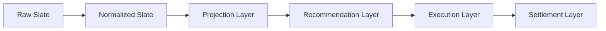

# IMMUTABLE_PIPELINE.md

Phases 3–7 — eliminating in-place mutation, incrementally. Sections below
are annotated "(Phase 3)", "(Phase 4)", "(Phase 5)", "(Phase 6)", or
"(Phase 7)" where the distinction matters; unmarked content still
reflects the current state of the pipeline.

**Mission reminder:** none of these phases are about betting
performance. No probability, projection, edge calculation, Rule 71/81,
bankroll sizing, calibration, portfolio, execution, or ledger logic was
changed in any of them. Production behavior is identical before and
after every commit — proven by regression tests, not assumed.

---

## 1. Background

Phase 2's audit (`docs/MODEL_V2_ARCHITECTURE.md` §7) found that
`data/slate.json` is mutated in place by **ten** different scripts across
a single `fetch-slate.yml` run, with no schema boundary or immutable
checkpoint between any of them. This makes it impossible to inspect what
any one stage actually changed without diffing the whole file, and it's
the root cause of an entire class of bug (a later stage silently
assuming an earlier stage's output shape, as in the Phase 1 incident).

This phase does not eliminate that in one pass — the mission brief is
explicit: *"Do NOT rewrite the repository all at once. Introduce the
architecture incrementally. Maintain backwards compatibility wherever
practical. Prefer adapters over breaking changes."* What follows is what
was actually done, chosen specifically to be the safest available
incremental step, not the most complete one.

---

## 2. Target pipeline

Mapped onto the actual scripts in this repository:

| Layer | Scripts (current pipeline order) | Status |
|---|---|---|
| **Raw Slate** | `api/slate.js` fetch → initial `data/slate.json` write | Unchanged — this is the input, not a mutator |
| **Normalized Slate** | `fetch_savant_pitchers.py` → `fetch_lineups.py` → `enrich_lineup_confirmed.py` → `post_fetch_gate.py` → `merge_odds.py` → `enrich_data.py` | **Five scripts now converted to immutable transforms** (`enrich_lineup_confirmed.py` in Phase 3; `merge_odds.py` in Phase 4; `fetch_savant_pitchers.py` and `fetch_lineups.py` in Phase 5; `post_fetch_gate.py` in Phase 6 — see §4). **One boundary artifact** (`enrich_data.py` → `normalized_slate.json`, Phase 3). `post_fetch_gate.py` was the last remaining mutator in this layer — the Normalized Slate stage is now fully converted. **Order correction (Phase 5):** this row previously listed `fetch_lineups.py` before `fetch_savant_pitchers.py` — the actual `.github/workflows/fetch-slate.yml` order is the reverse (`fetch_savant_pitchers.py` runs first); fixed here as a documentation-accuracy correction found during the Phase 5 audit, not a pipeline behavior change. |
| **Projection Layer** | `compute_projections()` inside `scripts/build_market_ledger.py` | **(Phase 4) Boundary artifact added**: `projections.json`, snapshotting `compute_projections()`'s output for every game before any recommendation decision is made. **(Phase 6)** `compute_projections()` itself is unchanged, but it is now called exactly ONCE per game per run (wrapped by the new `compute_game_projection_context()`), in a single list `main()` builds before either consumer — see §4's Phase 6 subsection. Before Phase 6, this boundary artifact and the Recommendation Layer below each called `compute_projections()` independently on the same game object; they always agreed (the function is pure and nothing mutates a game's projection fields between the two calls) but this was incidental, not structurally guaranteed. |
| **Recommendation Layer** | `build_market_ledger.py` (populates `marketLedger`) | **Boundary artifact** (`recommendations.json`, Phase 3, metadata clarified Phase 4 — see §3). The script's internal evaluation logic (`evaluate_game()`) is untouched in behavior across all phases — far too large and load-bearing to safely rewrite. **(Phase 6)** `evaluate_game()` gained an optional `projection_context` parameter so it can consume the Projection Layer's single canonical result instead of recomputing it internally; see §4's Phase 6 subsection for the full before/after contract. |
| **Execution Layer** | `protect_slate.py` → `risk_gate.py` → `write_pending_bets.py` → `validate_bet_logging.py` → `write_tracked_tickers.py` → `capture_closing_lines.py` | **(Phase 7)** `risk_gate.py` converted — see §11 (rewritten for Phase 7) for the full before/after. It still mutates `data/slate.json` in place exactly as before (production behavior is unchanged, byte-for-byte, on every golden test), but its TT-safety and portfolio-composition decisions are now made by pure functions (`evaluate_candidate_tt_risk()`, `build_risk_portfolio()`) that `apply_tt_safety()`/`apply_portfolio_rules()` call and then apply as the only mutation step. A new canonical boundary artifact, `data/pipeline/<date>/execution.json`, is published best-effort alongside the unchanged legacy write (§3). `protect_slate.py` was converted in Phase 9 — see §13 for the full before/after. |
| **Settlement Layer** | `clv_update.py` (root, separate `clv-update.yml` workflow) | Untouched — separate workflow, separate concern, not part of either pass. |

---

## 3. Artifact ownership map

| Artifact | Path | Owner (writer) | Content | Status | Metadata `status` / `sourceStage` |
|---|---|---|---|---|---|
| Normalized Slate | `data/pipeline/<date>/normalized_slate.json` | `scripts/enrich_data.py` | Full slate object exactly as written to `data/slate.json` at that point in the pipeline | Phase 3 | `"canonical"` (default — predates the `status` field, never explicitly re-labeled since it is, in fact, the intended contract for this stage today) / `null` |
| **Projections** | `data/pipeline/<date>/projections.json` | `scripts/build_market_ledger.py` (`compute_projections()` snapshot, before `evaluate_game()`'s per-game loop) | **Narrowed** per-game array: `away`, `home`, `kalshiKey`, `awayProjRuns`, `homeProjRuns`, `totalProj`, `f5AwayProj`, `f5HomeProj`, `missingFields`, `excludedFromSlate` — nothing else | **New in Phase 4** | `"canonical"` / `"normalized_slate"` |
| Recommendations | `data/pipeline/<date>/recommendations.json` | `scripts/build_market_ledger.py` | Full slate object (including populated `marketLedger` per game) exactly as written to `data/slate.json` at that point | Phase 3, metadata clarified Phase 4 | `"transitional"` (explicit as of Phase 4 — see below) / `"projections"` |
| **Execution** | `data/pipeline/<date>/execution.json` | `scripts/risk_gate.py` (`build_execution_artifact_payload()`, called after `apply_tt_safety()`/`apply_portfolio_rules()`/the PAPER_ONLY third pass have all already run — never a second computation of the decision) | **Narrowed** per-candidate array: `game`, `market`, `sourceRecommendationTicker`, `status`, `tier`, `realMoneyEligible`, `rejectionReason`, `approvedStake`, `approvedPrice`, `gameExcluded`, `order`; plus top-level `date`, `decision`, `decisionReason`, `rulesVersion`. Excludes any settlement/PnL/final-score/historical-reconciliation field. | **New in Phase 7** | `"canonical"` / `"recommendations"` |
| **Validation** | `data/pipeline/<date>/validation.json` | `scripts/validate_slate_final.py` (`build_validation_artifact_payload()`, called with the exact `(errors, warnings)` `validate_final()` already computed — never a second validation computation) | **Narrowed**: `date`, `status` (`"pass"`/`"fail"`), `gameCount`, `errorCount`, `warningCount`, `errors` (ordered), `warnings` (ordered). No per-game-market decision detail (this script doesn't own that — `build_market_ledger.py` does), no settlement/PnL field, no full-slate payload. | **New in Phase 8** | `"canonical"` / `"recommendations"` |
| **Protection** | `data/pipeline/<date>/protection.json` | `scripts/protect_slate.py` (`build_protection_artifact_payload()`, called with values `main()` already computed by that point — `run_type`, `sentinels`, `save_slate()`'s own `result`, the sync decision — never a second protection computation) | **Narrowed**: `date`, `runType`, `status` (`"ok"`/`"quarantined"`), `sentinelCount`, `savedPaths`, `authoritativeWritten`, `authoritativeUpdated`, `runReportSummary` (counts only — `acceptedCount`/`rejectedCount`/`frozenCount`/`quarantined`, never the per-game breakdown `lib/slate_manager.py`'s own `runReport` carries), `syncedLegacySlateJson`, `authoritativeExists`. No settlement/PnL field, no full-slate payload. | **New in Phase 9** | `"canonical"` / `"validation"` |
| Legacy working slate | `data/slate.json` | Still all ten scripts from Phase 2's audit | Unchanged in every way | Untouched | N/A |
| Authoritative slate | `data/slates/<date>/authoritative.json` | `protect_slate.py` (via `lib/slate_manager.py`) | Unchanged | Untouched — already its own immutable-ish artifact per Phase 2's findings, just not built on the same primitive introduced here. **(Phase 7)** Confirmed it is written BEFORE `risk_gate.py` runs each workflow invocation and never re-derived afterward — it is a pre-risk-gate recommendation snapshot, `execution.json` is the post-risk-gate execution-decision snapshot, and the two are intentionally never reconciled (§11, §13). | N/A |

All three pipeline artifacts are written via the single shared primitive,
`lib/pipeline_artifacts.write_stage_artifact(stage, date, data,
produced_by=None, status="canonical", source_stage=None)`
(`lib/pipeline_artifacts.py`), so any future stage that wants to publish
its own immutable checkpoint uses the same call, the same path
convention (`data/pipeline/<date>/<stage>.json`), and the same
try/except-wrapped, non-fatal safety posture. `status` and `source_stage`
are Phase 4 additions to the envelope (see `lib/pipeline_artifacts.py`'s
module docstring) — both optional, both defaulting to values that leave
every Phase 3 caller's behavior unchanged.

**Why is `projections.json` narrowed but `recommendations.json` still
the full slate?** This is a direct, code-derived consequence of how each
artifact is produced, not an arbitrary choice:

- `compute_projections(g)` is a small, pure function of a handful of
  input fields (`awayTeamStats.offenseBaselineAdj`,
  `away.pitcherSavant.xFIP`, `away.bullpen.xFIP`, `park.parkFactor`, and
  their home-side equivalents) that returns exactly five values
  (`away_proj, home_proj, f5_away, f5_home, missing_fields`). Building a
  narrow artifact from its output required zero extraction risk — the
  function already returns precisely the payload the artifact needs, so
  `projections.json` is written as `status: "canonical"`: this genuinely
  is the intended schema for the Projection Layer, not a placeholder.
- `evaluate_game(g)`, by contrast, builds each market row (`marketLedger`
  entries) by reading and threading through dozens of fields from the
  full game object — team stats, lineup-confirmation fields, Kalshi
  prices, pitcher Savant data — that live alongside, not inside, the
  eleven `marketLedger` rows it produces. Narrowing `recommendations.json`
  to just `marketLedger` would require verifying every current and future
  downstream reader only needs those eleven rows and nothing else from
  the game object — a real schema-design effort
  (`docs/CANONICAL_SCHEMAS.md`, scoped by Phase 2) that risks breaking
  behavior if rushed. Per the Phase 4 mission's explicit instruction not
  to narrow this artifact if doing so "requires a broad
  `build_market_ledger.py` rewrite," it remains the full slate object,
  now explicitly labeled `status: "transitional"` in its own metadata
  (previously this was documented only in prose, in this file) so a
  reader inspecting the artifact directly — without first reading this
  doc — still gets the signal.

**What belongs in `recommendations.json` and what doesn't (Phase 4
clarification):** the artifact's name describes the *layer boundary* it
marks (the point where `marketLedger` — one row per required market,
with `status`/`edge`/`confidence`/`rejectionReason` — becomes populated),
not a promise that its contents are limited to recommendation data (they
aren't, per the above). To remove any ambiguity about what a
"recommendation" is in this pipeline, restated explicitly:

- **Projections are inputs to a recommendation, not recommendations
  themselves.** `awayProjRuns`/`homeProjRuns`/`f5AwayProj`/`f5HomeProj`
  answer "what does the model think will happen"; they carry no
  accept/reject verdict and are unaffected by Kalshi pricing, calibration,
  or gates. `projections.json`'s `sourceStage: "normalized_slate"`
  reflects that projections are computed from the normalized slate,
  independent of any market or recommendation logic.
- **Recommendations are the `marketLedger` rows themselves** — each row's
  `status` (`Accepted`/`Rejected`/`Missing Data`/`Evaluation Failed`),
  `edge`, `confidence`, and `rejectionReason` are `evaluate_game()`'s
  actual output. This is the only data `recommendations.json` is named
  for; everything else riding along in the full-slate snapshot is
  transitional baggage documented above, not part of the "recommendation"
  concept.
- **Execution decisions are not recommendations.** Whether a recommended
  bet is actually placed — position sizing after portfolio concentration
  checks, `risk_gate.py`'s TT-downgrade logic, `protect_slate.py`'s
  official/recheck routing — happens strictly after
  `build_market_ledger.py` returns, in the Execution Layer (§2), and none
  of it is captured by either `projections.json` or
  `recommendations.json`. `risk_gate.py` in particular was not touched
  this phase (§11) and does not write to either pipeline artifact.
- **Risk-gate results are not recommendation generation.** Rule
  71/81-style suspensions that are already baked into
  `evaluate_game()`'s own logic (e.g. the RL/Game_Total paper-only
  suspensions) are part of recommendation generation because they
  determine the row's `status`/`confidence` directly; `risk_gate.py`'s
  separate, later portfolio-level gate is a distinct concern applied
  after recommendations already exist, and is out of scope for both
  artifacts.
- **Ledger settlement data doesn't belong here.** CLV/closing-price
  fields (`closingPrice`, `clvVsSnapshot`, etc.) exist as `null`
  placeholders in each `marketLedger` row's schema (see
  `make_row()`/`build_edge_fields()` in `scripts/build_market_ledger.py`)
  but are only ever populated later, by the Settlement Layer's
  `clv_update.py` — a completely separate workflow. Neither pipeline
  artifact is re-written when settlement happens; both remain frozen
  snapshots of the moment they were produced.

---

## 4. Scripts converted to immutable outputs

**Four full conversions:** `scripts/enrich_lineup_confirmed.py` (Phase 3),
`scripts/merge_odds.py` (Phase 4), and `scripts/fetch_lineups.py` /
`scripts/fetch_savant_pitchers.py` (Phase 5).

### `enrich_lineup_confirmed.py` (Phase 3)

The per-game field computation (`lineupConfirmed`, `lineupSource`,
`lineupStatus`, `lineupCheckedAt`, `lineupAuditUsed`) was extracted,
unchanged, into a pure function `compute_game_lineup_fields(g, ...)` that
takes a game dict and returns new field values without reading from or
writing to `g`. `enrich_games_immutable(games, ...)` builds a **new**
list of game dicts (`{**g, **fields}` per game) instead of mutating each
game in the loop, and `main()` assembles a **new** slate object
(`{**slate, 'games': new_games}`) instead of mutating the loaded one.
The script still writes to the same `data/slate.json` path — the change
is entirely about *how* the new content is built, not *what* gets
written or *where*.

Chosen first because: it was the smallest of the ten confirmed mutators,
had a single well-isolated responsibility, and already had direct
existing test coverage (`tests/test_lineup_gate.py`,
`tests/test_phase1_lineup_fields.py`) to lean on as an independent
correctness check beyond this phase's own new tests.

### `merge_odds.py` (Phase 4)

Unlike `enrich_lineup_confirmed.py`, this script has no `main()` — it is
a top-level script that executes its full logic (data loads, per-game
matching/injection loop, `data/slate.json` write, diagnostic prints) at
import/run time. The per-game odds/Kalshi-injection logic was extracted
into `compute_game_odds_fields(game, odds_games, registry, rfi_by_key)`,
a pure function returning `(new_game, matched, unmatched_label,
log_lines)` — a **new** game dict, never a mutation of the input.
`merge_odds_immutable(slate, odds_games, registry, rfi_by_key)` then
builds a **new** slate object the same way `enrich_games_immutable()`
does. The top-level script body was reduced to: load inputs (unchanged
error-handling for each — `data/odds.json` still crashes uncaught if
missing/malformed, `data/slate.json` still exits(1) on parse failure,
the registry/`kalshi_raw.json`/`kalshi_search.json` reads keep their
original tolerant fallbacks), call `merge_odds_immutable()`, print the
returned `log_lines` in the same order they were previously printed
inline, write the result to `data/slate.json`, then run the unchanged
diagnostic-summary block against the new slate. CLI invocation
(`python3 scripts/merge_odds.py`) and every file path are unchanged —
`.github/workflows/fetch-slate.yml` did not need to change.

**One purity fix found and corrected as a byproduct, not a behavior
change:** the pre-refactor code aliased `game['odds']` directly to the
matched `data/odds.json` entry's `books` dict (`game['odds'] =
best.get('books', {})`), then mutated its `kalshi` sub-block in place via
`.setdefault('kalshi', {})`. In this codebase that specific aliasing
never produced observably wrong output — `find_registry_entry()` is a
pure function of the matched entry's own team names, so even if two
slate games somehow matched the same `data/odds.json` entry, both would
deterministically recompute identical Kalshi data — but it did mean
`merge_odds.py` mutated the parsed `data/odds.json` structure as a side
effect of populating `data/slate.json`, which is exactly the kind of
caller-owned-object mutation this conversion exists to eliminate. The
immutable version copies (`dict(...)`) both `books` and its nested
`kalshi` block before writing into them, preserving any pre-existing
kalshi-native content (see the `TestPreExistingKalshiBooksPreserved` test
class) without ever aliasing the input.

Golden-equivalence method: `tests/test_merge_odds_immutable.py` (21
tests) was written and run against the **original** implementation
first, covering complete/missing/partial market coverage, sentinel and
null prices, malformed-but-tolerated inputs, game-status invariance
(postponed/live/final/excluded), the pre-existing-`kalshi`-block
preservation scenario, `pinVigFree` removal, multi-game ordering, and
idempotency — then re-run **unchanged** after the refactor, all 21 still
passing. The pre-existing `tests/test_rfi_fallback.py` (25 tests,
including its fragile source-text extraction of `_american_from_mid`/
`_build_rfi_from_ks_market`, which remain textually untouched) also still
passes unchanged.

### `fetch_lineups.py` and `fetch_savant_pitchers.py` (Phase 5)

Both scripts already had a real `main()` (unlike `merge_odds.py`) and
already isolated their network calls behind small functions
(`fetch_json()`, and `fetch_savant_pitchers.py`'s `fetch_batch()`), so
this conversion was more mechanical than architectural. Each was split
into the shape used across this repository's immutable conversions —
network adapter → pure parser → pure per-game transform → pure
per-slate transform → orchestration `main()`:

- **`fetch_lineups.py`**: `fetch_boxscore(game_pk)` (network adapter,
  thin wrapper around the unchanged `fetch_json()`) → `parse_lineup_response(data, away_abbr, home_abbr, batter_woba_map, team_woba_map)`
  (pure parser — the exact per-side computation the old
  `fetch_lineup_for_game()` always did, now with zero network/file/env/
  clock dependency) → `compute_game_lineup_stats_fields(game, lineup_result)`
  (pure per-game transform, returns new `awayTeamStats`/`homeTeamStats`
  dicts) → `apply_lineups_immutable(slate, lineup_results)` (pure
  per-slate transform). `main()` now runs two passes: fetch+parse every
  game first (network + pure parse, no slate mutation), then one
  `apply_lineups_immutable()` call. `fetch_lineup_for_game()` is kept as
  a thin fetch+parse wrapper preserving its exact original signature, in
  case anything ever calls it directly (nothing currently does). The
  four structurally-identical "missing/error lineup" 13-field dict
  literals (no gameId, batting order not yet posted, API returned
  nothing, exception while processing) were factored into one
  `missing_lineup_fields(reason, status)` helper — same fields, same
  values, just no longer four hand-copied literals that could silently
  drift apart. The pre-existing, provably-unreachable
  `len(lineup_wobas) < 1` branch (`batters_order` is already checked
  non-empty earlier, so `lineup_wobas` always has ≥1 entry) was left
  completely untouched, per the mission's explicit instruction not to
  remove unrelated dead code.
- **`fetch_savant_pitchers.py`**: `fetch_json()`/`fetch_batch()` (network
  adapters, including the retry/backoff loop) are unchanged.
  `compute_pitcher_savant_enrichment(ps, pid, ...)` (pure per-side
  enrichment) and `sanitize_recent_fip(ps)` (pure per-side
  sanitization — returns `None` when no change is needed, mirroring the
  original's `continue` conditions, including that sanitization runs
  independent of pitcher-ID resolvability) replace the two in-place
  mutation loops main() used to run over `games`.
  `compute_game_pitcher_savant_fields(game, ...)` applies both, in the
  same order, per game, returning a new game dict plus a small report
  dict so `main()` can reproduce the exact original summary counts/
  prints (`updated`, `vel_resolved`, the velocity-drop warning,
  `cleared`, `sanitized`) without re-deriving them from the transformed
  data. `apply_savant_enrichment_immutable(slate, ...)` is the pure
  per-slate transform. `main()` fetches every batch exactly as before,
  then makes one transform call, then a bookkeeping loop over the
  returned reports to print/count.

**Atomic write, applied to both (Phase 5 Part 8):** both scripts'
`data/slate.json` write was hardened from a plain `open(path, 'w')` +
`json.dump()` to a small local `_write_slate_atomic()` (temp file in the
same directory, `fsync`, `os.replace()`) — the same mechanism
`lib/pipeline_artifacts.py` uses, applied inline rather than by
importing that helper (which wraps its payload in a meta/data envelope
`data/slate.json`'s format must not have). This was verified empirically
during the audit: a plain `open()+json.dump()` leaves a truncated,
invalid JSON file on disk if serialization fails partway through (the
call writes incrementally); the atomic version leaves the previous valid
file completely untouched instead. Output content is byte-for-byte
identical to before in the success path — only the failure-mode
guarantee changed, which is why this was treated as in-scope for this
phase rather than deferred like `lib/slate_manager.py`'s equivalent gap
(§9) — that file is the authoritative slate and considerably
higher-stakes; these two scripts' plain writes were a much lower-risk,
narrower fix.

**Doubleheader identity (Phase 5 Part 7):** both scripts were audited
against the `kalshiKey`-style doubleheader ambiguity PR #5 found in
`merge_odds.py`. Neither is exposed to it: `fetch_lineups.py` fetches
each game directly by its own `gameId` (MLB's `gamePk`), and
`fetch_savant_pitchers.py` keys every enrichment lookup off each
game-side's own embedded `pitcher.id` — neither ever matches by team
name against an external list the way `merge_odds.py`'s
`find_registry_entry()` does. No code change was needed; regression
fixtures (two games, identical team abbreviations, distinct
`gameId`/pitcher IDs) were added to both golden-equivalence suites to
lock this in.

Golden-equivalence method (both scripts): written and run against the
**original** implementation first — `tests/test_fetch_lineups_immutable.py`
(36 tests: complete/unconfirmed/partial lineups, missing gameId, game-
status invariance, excluded games, doubleheader, mismatched team
abbreviations, empty/malformed API responses, real `fetch_json`
exception-swallowing, mixed success, ordering/top-level preservation,
idempotency, object-identity/aliasing proofs, crash-before-write, atomic
write) and `tests/test_fetch_savant_pitchers_immutable.py` (42 tests:
pitcher-resolution combinations, name normalization, duplicate names,
missing ID/fields, null/malformed metrics, empty/partial responses,
missing/malformed slate, the top-level try/except/exit(1) contract,
mixed success, doubleheader, ordering/top-level preservation,
idempotency, retry/backoff timing, object-identity/aliasing proofs,
crash-before-write, atomic write) — then re-run **unchanged** after each
refactor, all still passing. A pre-existing test-isolation bug was also
found and fixed along the way: `tests/test_clv_hardening.py`'s
`TestFetchSavantPitchers` class made real network calls to the Vercel
enrich endpoint (no mocking at all), burning ~17-18s per test on retry
backoff against a failing connection; patching `fetch_batch` to return
`{}` in its shared `_run_main()` helper (none of that class's tests
assert on enrichment values) fixed this with no change in test meaning,
dropping the full suite's runtime from ~90s to ~21s.

**Additive artifact snapshots (not full conversions):**
`scripts/enrich_data.py` (Phase 3) and `scripts/build_market_ledger.py`
(Phase 3 for `recommendations.json`, Phase 4 for `projections.json`,
Phase 6 for the projection/recommendation single-call boundary — see
below) — see §3. Their internal mutation/evaluation logic (`evaluate_game()`)
is otherwise untouched.

### `post_fetch_gate.py` (Phase 6)

The last remaining Normalized Slate mutator. Unlike every prior
conversion in this document, it had no `main()`/importable functions at
all before Phase 6 — the entire script was top-level module code with
no `if __name__ == '__main__':` guard, so every existing test exercised
it via `subprocess.run(...)`. Converted to:

- **`load_inputs(path)`** — I/O adapter, the file read.
- **`find_stale_slate_issue(slate, requested_date)`** — pure lookup
  covering the slate-level and per-game stale-date checks (empty games,
  missing date field, slate-date mismatch, per-game `startTime`/
  `gameTime` mismatch — stopping at the first issue found, exactly as
  the legacy immediate-exit loop did).
- **`evaluate_game_pitcher_savant(g)`** / **`evaluate_game_team_stats(g)`**
  — pure per-game gate evaluators, one per legacy scan pass.
- **`apply_post_fetch_gate_immutable(slate)`** — pure per-slate
  transform, returning a new slate object plus an aggregated result
  dict. Preserves the legacy **two-pass order** exactly (all
  pitcherSavant-phase findings across all games, in game order, THEN
  all teamStats-phase findings across all games, in game order) since
  this ordering is externally observable — `fetch_status.json`'s
  `FAILED_GATE` reason joins `errors[:3]`, and stdout's WARNINGS/GATE
  FAILED lists print in this order.
- **`main()`** — orchestration adapter: all file I/O, printing, and
  `sys.exit()` calls. Gained an `if __name__ == '__main__':` guard so
  the pure functions can be imported and exercised directly without
  triggering a live run as an import side effect — a no-op for
  production, which always invokes this file directly as a script.

**Real finding preserved, not fixed:** the quarantine-marker write-back
to `data/slate.json` has no dependency on whether hard errors are later
found in the teamStats pass — a run that quarantines one game AND
separately hard-fails on a different game (e.g. all-null RpG) still
persists the quarantine marker before exiting 1. This is real,
load-bearing behavior, preserved exactly.

**Two real regressions were caught against the golden baseline during
the refactor itself, both fixed before landing:** (1) the "no games"
stale-date path had lost its `GATE FAIL: data/slate.json has no games`
stderr line, which legacy code printed in addition to the `STALE SLATE
ABORT` line; (2) the per-game `[QUARANTINE] ...` stdout lines (from the
legacy `quarantine_game()` helper) were dropped entirely, since the new
pure transform cannot print — moved into `main()`, printed in the same
game order right after the pure transform runs.

**Write safety (Phase 6 Part 5):** the quarantine-marker write, a plain
non-atomic `open()+json.dump()` before this phase, now uses a new shared
helper, `lib/atomic_json.write_json_atomic()` — see below.

### Consolidated atomic-write helper (Phase 6 Part 5)

Phase 5 independently inlined byte-for-byte identical atomic-write code
into `fetch_lineups.py`'s and `fetch_savant_pitchers.py`'s private
`_write_slate_atomic()` helpers, and deliberately deferred consolidating
them. `lib/atomic_json.write_json_atomic(payload, path)` is that
consolidation: one small shared plain-JSON atomic writer (deliberately
distinct from `lib/pipeline_artifacts.py`'s `write_stage_artifact()`,
which wraps its payload in a meta/data envelope `data/slate.json`'s
format must not have). Migrated callers: `fetch_lineups.py`,
`fetch_savant_pitchers.py` (both now delegate instead of duplicating),
and `post_fetch_gate.py`'s new atomic write. **Deliberately not
migrated:** `lib/slate_manager.py`'s `_write_json()` (used for
`data/authoritative.json`) — out of scope for Phase 6 and not named
anywhere in its mission. This is a scoped, three-caller migration, not a
repository-wide one.

### `build_market_ledger.py`'s projection/recommendation boundary (Phase 6)

Before Phase 6, `compute_projections(g)` was called from two independent
sites on the same game object: once in `main()`'s
`projections.json`-building loop, once again inside `evaluate_game()`
itself. Both calls always agreed — the function is pure and nothing
mutates a game's projection-input fields between them — but only
incidentally, not by any structural guarantee.

- **`compute_game_projection_context(g)`** — new pure wrapper around
  `compute_projections(g)`, returning the canonical dict shape both
  consumers need (`awayProjRuns`/`homeProjRuns`/`totalProj`/
  `f5AwayProj`/`f5HomeProj`/`missingFields`).
- **`main()`** now computes `game_contexts = [compute_game_projection_context(g)
  for g in games]` exactly once, before either consumer, and passes each
  game's entry explicitly into `evaluate_game(g, projection_context=ctx)`.
  This list is built **outside and ahead of** the `projections.json`
  artifact-write's `try/except`, so an artifact-publication failure can
  never prevent or alter recommendation generation (see §9's failure-
  isolation tests).
- **`evaluate_game(g, projection_context=None)`** — the added parameter
  is a transitional, backward-compatible adapter: when omitted (every
  existing direct test caller — `tests/test_lineup_gate.py`,
  `tests/test_rule40_rfi_gate.py`, `tests/test_bet_eligibility.py` —
  calls it with just `g`), the function computes the context internally
  exactly as it always implicitly did. No recommendation output changed
  — `marketLedger` row content, status, reason strings, edge/probability
  values, and ordering are all byte-identical to before.
- **`game_projection_identity(g, index)`** — a small pure identity
  selector (`gameId` > `kalshiKey` > list-index fallback) documenting the
  projection-identity policy. **Correction (PR #7 review, Section M):**
  this function is not actually called anywhere in `main()` — an earlier
  draft of this section claimed it was used to label `projections.json`'s
  records, but that record's additive `gameId` field is populated by a
  separate, direct `_g.get('gameId')` call instead. The function remains
  a standalone, independently tested policy for a future phase that might
  need a keyed (not positional) lookup, e.g. reading `projections.json`
  back from disk (see §8's Part 8 discussion) — not wired into any
  current call site. `gameId` is preferred over `kalshiKey` in this
  policy because it is immune to the `kalshiKey` doubleheader-collision
  risk found in `merge_odds.py` during Phase 4. Whether or not this
  function is ever called, the actual projection-to-`evaluate_game()`
  wiring in `main()` stays **positional** (same `games` list, same order,
  single pass) — this has
  zero identity-collision risk by construction and needs no keyed lookup
  at runtime. Phase 6 does not redesign global game identity or attempt
  to fix the `kalshiKey` collision issue.

---

## 5. Remaining mutable scripts

**One** of the ten confirmed `data/slate.json` mutators is still
unconverted as of Phase 9 (`post_fetch_gate.py` moved from this list
into §4 in Phase 6; `risk_gate.py` moved into §11 in Phase 7;
`validate_slate_final.py` moved into §12 in Phase 8; `protect_slate.py`
moved into §13 in Phase 9), mapped to its layer above:

| Script | Layer | Why not converted yet |
|---|---|---|
| `write_pending_bets.py` | Execution Layer (reads only — does not write `data/slate.json`, listed for completeness since it's part of the same execution chain) | N/A — not a mutator of `data/slate.json`, included in Phase 2's list only as a boundary reference |

`risk_gate.py` (Phase 7's conversion, §11), `validate_slate_final.py`
(Phase 8's conversion, §12), and `protect_slate.py` (Phase 9's
conversion, §13) all still mutate `data/slate.json` (or, for
`protect_slate.py`, `authoritative.json` plus a `data/slate.json`
backwards-compat copy) in place — "converted" here means each script's
core decision logic was made pure and artifact-backed, not that the
legacy mutation was eliminated (mission: "non-mutating where
possible", not "non-mutating").

---

## 6. What was intentionally NOT done

Per each phase's explicit "DO NOT" list:

- No ledger reconciliation (`data/bets.json` vs. root `bets.json` — that's Phase 2's own recommendation, still untouched).
- No probability/projection/pricing/edge-calculation redesign, in any phase.
- No consolidation of the duplicate-logic findings from Phase 2's
  `docs/DUPLICATE_LOGIC_INVENTORY.md` beyond what was already done in
  that phase. This includes `tests/test_phase1_lineup_fields.py`'s
  `_simulate_lineup_fetch()` helper (Phase 5 finding), which reimplements
  `fetch_lineups.py`'s lineup-computation logic standalone rather than
  calling the real, now-pure `parse_lineup_response()` — a duplicate-
  logic shadow risk noted for a future consolidation pass, not touched
  here. **(Phase 6)** Re-examined and confirmed the drift is real (the
  shadow uses a flat league-average fallback for unresolved batters
  instead of the real `get_positional_fallback()`'s per-position
  lookup) but currently latent — no test in that file asserts an exact
  numeric value the drift would affect. Fixing it properly requires
  rebuilding its fixtures around a real boxscore-shaped `data` dict with
  per-player position info to call `parse_lineup_response()` directly —
  broader test restructuring than either phase's scope covers, so it
  remains documented follow-up debt, not fixed.
- **(Phase 6) No redesign of global game identity, and no fix to the
  `kalshiKey` doubleheader-collision issue.** `build_market_ledger.py`'s
  new `game_projection_identity()` helper (§4) documents which
  already-present field (`gameId` vs `kalshiKey`) this one script would
  prefer for a keyed lookup, but is not currently called from anywhere
  (see §4's correction) — it does not change how any other script
  identifies a game, and the actual projection-to-`evaluate_game()`
  wiring never performs a keyed lookup at all (it's positional), so the
  `kalshiKey` collision risk
  `merge_odds.py` has (Phase 4) is unaffected either way.
- **(Phase 6) No conversion of `validate_slate_final.py` or
  `protect_slate.py`.** Both remain exactly as documented in §5 —
  outside this phase's two tightly-scoped objectives.
- **(Phase 6) No `risk_gate.py` work of any kind.** See §11.
- **(Phase 6) `evaluate_game()`'s ~1250 lines of edge/confidence/gate
  logic were not rewritten, reorganized, or narrowed.** The only change
  is the new optional `projection_context` parameter (a small,
  additive, backward-compatible seam) — every accepted/rejected/missing/
  failed row's content, status, and reason string is byte-identical to
  before. A true structural split of `evaluate_game()` itself (e.g.
  extracting its market-by-market logic into smaller functions) remains
  real future work, not attempted here.
- No removal of any duplicate implementation as part of any refactor —
  none of the scripts converted/instrumented across Phase 3, 4, or 5 had
  duplicate-logic findings against them in Phase 2's inventory requiring
  removal (the one exception just noted above is flagged, not removed).
- **(Phase 5) No retry logic added to `fetch_lineups.py`.**
  `fetch_savant_pitchers.py` has real retry/backoff on transient errors;
  `fetch_lineups.py` has none — a single failed boxscore fetch
  permanently produces a "missing" lineup for that game in that run.
  Adding retry would be a genuine behavior change (it could change which
  games end up "missing" under a transient failure), so per the
  mission's "document rather than silently fix" instruction for
  behavior-affecting reliability changes, this asymmetry is documented
  here and locked in by
  `tests/test_fetch_lineups_immutable.py::TestRealFetchJsonExceptionSwallowing`,
  not changed.
- **(Phase 5) No change to `post_fetch_gate.py`.** Still the sole
  remaining Normalized Slate mutator (§5) — its `sys.exit()`-coupled
  hard-fail gate needs its own control-flow design decision before a
  pure-transform conversion can apply, out of scope for this phase.
  **Superseded in Phase 6**, which did convert it — see §4's Phase 6
  subsection.
- **(Phase 4) Partial, not full, separation of the Projection Layer from
  the Recommendation Layer.** `projections.json` (§3) now gives an
  independently inspectable snapshot of "what did the model think,"
  separate from "what did we recommend" — but this is a snapshot, not a
  structural split. `evaluate_game()` still computes recommendations by
  calling `compute_projections()` internally exactly as before; the two
  computations are not decoupled inside `build_market_ledger.py` itself,
  and `evaluate_game()`'s ~1250 lines of edge/confidence/gate logic were
  not touched, reorganized, or reduced. A true structural split — where
  `build_market_ledger.py` reads `projections.json` as its input rather
  than recomputing projections itself — is real future work (§7), not
  attempted here because it would require rewriting `evaluate_game()`'s
  call sites, which risks the exact kind of behavior change both phases'
  missions explicitly forbid.
- **(Phase 4) No narrowing of `recommendations.json`.** Per the mission's
  explicit instruction, it remains the full-slate transitional snapshot
  it was in Phase 3 — only its metadata was clarified (`status:
  "transitional"`, `sourceStage: "projections"`), not its shape. See §3
  for the full reasoning.
- **(Phase 4) No changes to `risk_gate.py`.** See §11.

---

## 7. Recommended Phase 7 sequencing (historical — see §11/§14 for what Phase 7 actually did)

Items 1 and 2 from the original Phase 4 sequencing plan are now done:
`fetch_lineups.py`/`fetch_savant_pitchers.py` conversion (Phase 5, §4)
and `post_fetch_gate.py` conversion plus the `build_market_ledger.py`
projection/recommendation single-call boundary (Phase 6, §4). This
section is preserved as written at the end of Phase 6, for history; item
1 below is what Phase 7 acted on (§11) — see §14 for the current
(post-Phase-7) remaining-path list and the new Phase 8 recommendation.
What remained at the end of Phase 6:

1. **(Done, Phase 7 — §11.)** Consider whether `risk_gate.py`'s
   portfolio decision logic can be expressed as a pure function of the
   Recommendation Layer artifact — this is the highest-value but also
   highest-risk conversion candidate, since it directly touches
   execution decisions, and should not be attempted until the
   lower-risk stages have proven the pattern out in production. See §11
   for why this was deferred again in Phase 6 specifically, and for the
   full Phase 7 before/after.
2. Consider actually restructuring `evaluate_game()`'s own ~1250 lines
   of edge/confidence/gate logic (not just its projection-consumption
   seam, which Phase 6 already added) — e.g. splitting its
   market-by-market blocks into smaller named functions. Phase 6
   deliberately did not attempt this ("do not rewrite the full
   ~1250-line recommendation engine... use the smallest structural seam
   necessary"); a future phase could revisit whether more of it can be
   decomposed without changing any row's output.
3. Revisit `protect_slate.py` / `lib/slate_manager.py`'s existing
   artifact-routing design and decide whether to unify it onto
   `lib/pipeline_artifacts.py`'s simpler primitive, or keep its own
   richer (official/recheck/rejected) versioning scheme as the more
   appropriate model for the authoritative slate specifically.
4. Once `recommendations.json` no longer needs to carry the full slate,
   revisit narrowing it to just the `marketLedger` rows per game,
   retiring its `status: "transitional"` label in favor of `"canonical"`
   — still deferred (§3, §6) since it's independent of, and not required
   by, Phase 6's projection/recommendation wiring change.
5. Consider adding retry/backoff to `fetch_lineups.py`, matching
   `fetch_savant_pitchers.py`'s existing pattern — explicitly deferred in
   Phase 5 (§6) since it would be a genuine behavior change to which
   games end up "missing" under a transient failure, not a pure
   reliability correction like the atomic-write hardening that phase did
   make.
6. Consider a small, targeted consolidation of
   `tests/test_phase1_lineup_fields.py`'s `_simulate_lineup_fetch()`
   duplicate-logic shadow (§6) — re-confirmed still latent (not
   affecting any current assertion) during Phase 6's own review;
   requires rebuilding its fixtures around a real boxscore-shaped `data`
   dict to call `parse_lineup_response()` directly, which is broader
   test restructuring than either phase attempted.
7. Consider whether `validate_slate_final.py`'s execution-slip patch to
   `data/slate.json` and `protect_slate.py`'s own writes should also
   migrate onto the shared `lib/atomic_json.write_json_atomic()` helper
   (Phase 6, §4) now that it exists — not attempted in Phase 6, which
   scoped that migration to only the three callers directly relevant to
   its own two objectives.

---

## 8. Tests added

### Phase 3

| File | Covers |
|---|---|
| `tests/test_pipeline_artifacts.py` (43 tests) | `lib/pipeline_artifacts.py` itself — path construction and path-traversal rejection, envelope shape/metadata, atomic-write mechanics (no stray temp files, interrupted-write simulation, malformed pre-existing artifact overwrite), and the full failure-isolation matrix (directory-creation failure, write failure, serialization failure, invalid date, repeated/parallel writes) |
| `tests/test_enrich_lineup_confirmed_immutable.py` (22 tests) | Golden-output regression for the full immutable conversion of `enrich_lineup_confirmed.py` — written and passed against the original mutate-in-place implementation first, then re-run unchanged after the refactor; plus game-status invariance (postponed/live/final/excluded), malformed-input tolerance, non-mutation and shallow-copy-boundary proof, idempotency, and game-ordering preservation |
| `tests/test_immutable_pipeline_snapshots.py` (7 tests) | Both additive snapshot points (`enrich_data.py`, `build_market_ledger.py`) — artifact content and metadata match the legacy write exactly; artifact-write failures never affect the primary write; artifact date follows the slate's own date rather than the wall clock; reruns overwrite rather than duplicate; the artifact's full-slate content is explicitly proven and documented as a transitional snapshot |

72 new tests, all passing. Full suite at Phase 3 merge: 749 passed, 5
skipped, 0 failed (up from Phase 2's 677/5/0 baseline).

### Phase 4

| File | New tests | Covers |
|---|---|---|
| `tests/test_merge_odds_immutable.py` | 21 (new file) | Golden-equivalence regression for the `merge_odds.py` immutable conversion (§4) — written and run against the original implementation first, then re-run unchanged after the refactor. Complete odds coverage, missing book/Kalshi data, partial market availability, sentinel/null prices, malformed-but-tolerated inputs, pre-existing `books.kalshi` preservation (the `api/odds.js` interaction — see §4), `pinVigFree` removal, game-status invariance, multi-game ordering, idempotency |
| `tests/test_pipeline_artifacts.py` | +4 (47 total) | The new optional `status`/`source_stage` kwargs on `write_stage_artifact()` — default to `"canonical"`/`None`, can be set explicitly, round-trip correctly through `read_stage_artifact()` |
| `tests/test_immutable_pipeline_snapshots.py` | +9 (16 total) | The new `projections.json` artifact (`TestBuildMarketLedgerProjectionsSnapshot`) — content matches `compute_projections()`'s own output exactly, `status`/`sourceStage` metadata is `"canonical"`/`"normalized_slate"`, a quarantined (`excludedFromSlate`) game still gets a projection row, reruns overwrite in place, and the full Part 6 failure-isolation matrix at the script-integration level: a projections-write failure breaks neither the legacy `data/slate.json` write nor the independent `recommendations.json` artifact; an invalid slate date fails both artifact writes cleanly without breaking the legacy write or touching `data/bets.json`/`data/slates/<date>/authoritative.json` (explicitly proven present-but-untouched, not just absent); a normal run also leaves those two files untouched; a malformed pre-existing `projections.json` is cleanly overwritten; and a simulated mid-write crash (`os.fdopen` failure) leaves no partial `projections.json` behind while the later recommendations/legacy writes still complete. One pre-existing test in this file was updated (not just left passing) — the rerun test's `os.listdir()` assertion now expects both `projections.json` and `recommendations.json` in the date directory, since `main()` now writes both. |

34 new tests, all passing (existing `tests/test_rfi_fallback.py`'s 25
tests also re-verified passing unchanged, per §4). **Full `tests/` suite
at Phase 4: 783 passed, 5 skipped, 0 failed.**

### Phase 5

| File | New tests | Covers |
|---|---|---|
| `tests/test_fetch_lineups_immutable.py` | 36 (new file) | Golden-equivalence regression for the `fetch_lineups.py` conversion (§4) — complete/unconfirmed/partial lineups, missing gameId, game-status invariance (Postponed/Cancelled/Suspended/In Progress/Final/Scheduled — confirms the script never reads `game['status']`), excluded games, a doubleheader fixture (two games, identical teams, distinct `gameId`), mismatched/unknown team abbreviation, empty/malformed API response shapes, real `fetch_json`'s own exception-swallowing contract, mixed success across games, ordering/top-level preservation, idempotency, plus `TestAliasingAndIdentity` (6 tests, object-identity proofs), `TestPartialFailureSemantics`/`TestCrashBeforeWriteLeavesSlateUntouched` (prior-field preservation, crash-before-write, the documented no-top-level-guard exit behavior), and `TestAtomicWrite` (2 tests) |
| `tests/test_fetch_savant_pitchers_immutable.py` | 42 (new file) | Golden-equivalence regression for the `fetch_savant_pitchers.py` conversion (§4) — both/only-away/only-home/neither pitcher resolving, the null-pitcher crash regression this script was already hardened against, ID normalization, duplicate names, missing ID/fields, null/malformed metrics (`recentFIP` sanitization), empty/partial responses, missing/malformed slate, the try/except/`sys.exit(1)` contract, mixed success, a doubleheader fixture (identical teams, distinct pitcher IDs), ordering/top-level preservation, idempotency, `TestRetryAndBackoff` (6 tests — 5xx/429/timeout retry, permanent-4xx no-retry, exponential backoff timing, via a mocked `urlopen` and a no-op recording `time.sleep`), `TestAliasingAndIdentity` (8 tests), `TestPartialFailureSemantics`/`TestCrashBeforeWriteLeavesSlateUntouched`, and `TestAtomicWrite` (2 tests) |
| `tests/test_clv_hardening.py` | 0 (fix only) | Fixed a pre-existing test-isolation bug in `TestFetchSavantPitchers`'s shared `_run_main()` helper — it made real network calls to the Vercel enrich endpoint with no mocking at all, burning ~17-18s per test retrying against a failing connection with real `time.sleep()` backoff (4 tests, ~72s for that one class alone when run in file-isolation). Patching `fetch_batch` to return `{}` unconditionally changes nothing about what those 15 tests actually assert (none check enrichment values) while eliminating the real network calls and real sleeps. Contributed most of the ~90s → ~21s full-suite speedup this phase produced. |

78 new tests, all passing. `tests/test_phase1_lineup_fields.py`,
`tests/test_lineup_gate.py` (50 tests) and
`tests/test_clv_hardening.py::TestFetchSavantPitchers` (15 tests)
re-verified passing unchanged. **Full `tests/` suite at Phase 5: 886
passed, 5 skipped, 0 failed** (up from Phase 4's 783/5/0 — the increase
reflects both the 78 new tests and the ~90s→~21s runtime drop from
fixing the network-call test-isolation bug above).

### Phase 6

| File | New tests | Covers |
|---|---|---|
| `tests/test_post_fetch_gate_immutable.py` (new file) | 54 | Golden-equivalence regression for `post_fetch_gate.py`'s conversion (§4) — written and run against the original top-level-only implementation first via subprocess (it had no functions to import before this phase), then re-run unchanged after the refactor. Covers all 11 gate-decision steps from the Part 2 audit: missing/malformed slate, empty games, missing/mismatched date (slate-level and per-game `startTime`), pitcherSavant warn/fail/quarantine paths, dual-null-fip and majority-dual-null-fip hard fails, teamStats warn/fail paths, game-status invariance, doubleheader/reordered/pre-excluded-game scenarios, idempotency across reruns, the real "quarantine marker persists even on a later hard fail" finding, plus object-identity/no-mutation/no-I/O purity proofs and the atomic-write failure matrix once the module became importable |
| `tests/test_atomic_json.py` (new file) | 11 | The new shared `lib/atomic_json.write_json_atomic()` helper's own contract — serialization/`fdopen`/`fsync`/`chmod`/rename failure isolation, umask-default permissions (not `mkstemp`'s own 0600 default), pre-existing-destination-permissions not inherited, no-prior-file, repeated writes, temp file created in the destination directory |
| `tests/test_build_market_ledger_projection_boundary.py` (new file) | 24 | `evaluate_game()`'s new `projection_context` adapter (explicit-context output matches implicit computation exactly, for both fully-computable and partial-data fixtures; context/game non-mutation; a deliberately wrong context actually changes output, proving it's consumed not ignored), `compute_game_projection_context()`'s purity and shape, `game_projection_identity()`'s policy (prefers `gameId`, falls back to `kalshiKey` then list index; doubleheader/reordered/missing-ID/duplicate-ID scenarios), the structural single-call-per-game proof (`compute_projections()` called exactly once per game via monkeypatched call counting), the projections-written-equals-projections-used proof, and the full failure-isolation matrix (artifact write failure never alters `marketLedger` output, never touches `bets.json`/`authoritative.json`, `recommendations.json` still gets written, a directory-creation failure inside the artifact writer is still fully contained) |

89 new tests, all passing. `tests/test_fire_fixes.py::TestPostFetchGateQuarantine`
(8 tests), `tests/test_clv_hardening.py::TestPostFetchGate` (11 tests),
`tests/test_lineup_gate.py`/`tests/test_rule40_rfi_gate.py`/
`tests/test_bet_eligibility.py` (73 tests), and
`tests/test_immutable_pipeline_snapshots.py`'s projections-artifact suite
(25 tests) all re-verified passing unchanged. **Full `tests/` suite at
Phase 6: 1008 passed, 5 skipped, 0 failed** (up from Phase 5's 886/5/0 —
the increase reflects the 89 new tests plus the 2 new subprocess
workflow-compatibility tests added during the PR #6 pre-merge hardening
review that landed on `main` immediately before Phase 6 began).

---

## 9. Architecture-collision check (pre-merge hardening pass)

Compared `lib/pipeline_artifacts.py` against every other artifact-writing
or archival mechanism already in the repository:

| System | Date format | Write mechanism | Metadata fields | Collision? |
|---|---|---|---|---|
| `lib/pipeline_artifacts.py` (this PR) | `YYYY-MM-DD` | Atomic (temp file + `os.replace`, fsync'd) | `stage`, `slateDate`, `createdAt`, `schemaVersion`, `producedBy` | — |
| `lib/slate_manager.py` (`_write_json`, authoritative slate) | `YYYY-MM-DD` (`get_slate_dir`) | **Not atomic** — plain `open(path, "w")` | None (no envelope; raw slate content) | **Found: inconsistent atomicity.** Documented, not fixed in Phase 3 — `slate_manager.py` writes the actual authoritative slate and was far higher-stakes than that PR's scope. Still not fixed as of Phase 4 (see §7 item 5) — `projections.json`'s introduction did not touch this gap; it uses the same atomic primitive as every other `lib/pipeline_artifacts.py` caller. |
| `data/pipeline_status.json` (`fetch-slate.yml`'s stage-status step) | N/A (single file, not per-date) | Shell `jq` + git commit (not atomic at the filesystem level, but committed to git which provides its own history) | `runId`, `slateDate`, `completedAt`, `status`, `stages` | **Found: `slateDate` naming — already fixed** (see below). `runId` is not present in this PR's artifacts — documented as a known gap, not added (would require threading the GitHub Actions run ID into two Python scripts that don't currently receive it; no current consumer needs it). |
| `data/slates/<date>/{official,recheck,rejected_contaminated}_<ts>.json` + `authoritative.json` | `YYYY-MM-DD` directory, `<ts>` suffix on versioned files | Not atomic (same `_write_json`) | None | Distinct directory (`data/slates/` vs `data/pipeline/`) and distinct purpose (authoritative-slate versioning vs. layer-boundary snapshots) — no path or ownership collision. `authoritative.json`'s "official/recheck/rejected" state machine is a **richer, different versioning model** than this PR's simple overwrite-on-rerun — intentionally not unified this phase (see §7 item 5). |

**Correction made as a direct result of this check:** the envelope's date
field was renamed from `date` to `slateDate` to match
`data/pipeline_status.json`'s existing convention — the same concept
(the slate's own date) should not have two different names across the
two artifact systems this repository now has. This is the "minimal
correction necessary to keep this foundation unambiguous" called for by
the pre-merge review; it does not touch `lib/slate_manager.py` or
`data/pipeline_status.json` themselves.

**No conflicting ownership, ambiguous authoritative status, or path
collisions were found.** `lib/pipeline_artifacts.py`'s artifacts
(`data/pipeline/<date>/*.json`) and `lib/slate_manager.py`'s artifacts
(`data/slates/<date>/*.json`) live in disjoint directories, serve
disjoint purposes (transitional layer-boundary snapshots vs. the
authoritative slate's own versioning), and neither claims to be
authoritative over the other. No current script reads either of the two
new artifacts as authoritative — `data/slate.json` and
`data/slates/<date>/authoritative.json` remain the only things any
consumer actually treats as such.

**Not fixed, documented only:** `lib/slate_manager.py`'s non-atomic write
of the authoritative slate. This is a real, independently-existing gap
(not introduced by this PR) that this review surfaced by comparison —
recommended for a dedicated future pass given how much higher-stakes that
file's write path is, not addressed here per the explicit instruction not
to perform a broad unification in this PR.

---

## 10. Shallow-copy contract

`enrich_lineup_confirmed.py`'s immutable conversion (Phase 3) builds a
**new top-level** game dict per game (`{**g, **fields}`), but this is a
**shallow** copy — nested values the stage doesn't own (e.g.
`awayTeamStats`) are the exact same object, by reference, as the input's.
This is safe under this stage's own contract (it never mutates those
nested objects — proven by
`tests/test_enrich_lineup_confirmed_immutable.py`'s
`TestNonMutationAndIdempotency` class), but any **future** stage adopting
this same pattern must not assume its output's nested dicts are
independent from its input's. Deep-copying every nested structure on
every stage transform was considered and rejected as complexity without
a real current need — no existing caller violates the read-only contract.

**(Phase 4) `merge_odds.py`'s conversion follows the same contract, with
one addition specific to its own shape.** `compute_game_odds_fields()`
(§4) shallow-copies the game dict the same way, but because this script's
own job is specifically to *write* into a nested block
(`game['odds']['kalshi']`) rather than merely read from one, it also
copies that nested `odds` dict and its `kalshi` sub-dict before writing
into them — this is what fixed the aliasing byproduct described in §4.
Every other nested value on the game object (team stats, lineup fields,
etc.) that `merge_odds.py` doesn't itself write remains a shared
reference with the input, same as `enrich_lineup_confirmed.py`'s
contract. The general principle holds: **a stage only needs to copy the
nested structures it itself writes into; anything it only reads can
safely remain shared, provided it's never mutated.**

**(Phase 5) `fetch_lineups.py` and `fetch_savant_pitchers.py` follow the
same contract, with the same "copy only what you write into" shape.**
`compute_game_lineup_stats_fields()` copies `awayTeamStats`/
`homeTeamStats` (the blocks `fetch_lineups.py` writes into) but leaves
everything else on the game object shared by reference.
`compute_game_pitcher_savant_fields()` copies the `away`/`home`
sub-dicts and their `pitcherSavant` blocks (what it writes into) while
leaving every other nested value — including `pitcherSavant` fields
neither enrichment nor sanitization touches, like `xFIP`/`seasonFIP` —
shared by reference with the input, proven explicitly by
`TestPreExistingFieldsPreserved`-style assertions in both scripts'
golden suites (pre-existing unrelated keys survive by value, and in the
identity tests, by reference where nothing writes to them).

`risk_gate.py` was the one remaining script in the pipeline confirmed
(Phase 2's audit) to mutate nested team-stat/TT-downgrade blocks in
place — it is now converted (Phase 7); see §11 for the full before/after.
Its own writes follow the same "copy only what you write into" discipline
`merge_odds.py`, `fetch_lineups.py`, and `fetch_savant_pitchers.py`
established: `evaluate_candidate_tt_risk()` and `build_risk_portfolio()`
never mutate the `marketLedger` entries they're given, returning new,
independently-owned decision objects instead; `apply_tt_safety()` and
`apply_portfolio_rules()` remain the only places that write those
decisions back onto the entries, exactly as the single, unsplit
functions did before Phase 7.

---

## 11. `risk_gate.py`'s Phase 7 conversion

`risk_gate.py` was explicitly out of scope for Phases 3, 4, 5, and 6,
per each phase's mission ("do not change... portfolio logic, execution
decisions"; "do not modify risk_gate.py"; Phase 6's mission additionally
said "do not begin risk_gate.py work" outright) — see the prior revision
of this section for the reasoning on why it stayed deferred that long
(last decision point before real money moves; mutates a different
script's `marketLedger` rows rather than data it owns; the pattern
needed several lower-risk validation cycles first). Phase 7's mission
converted it, with an explicit, narrower goal than every earlier
conversion: *"The objective is not to improve the betting model... make
the existing execution decision explicit, deterministic, testable,
non-mutating where possible, artifact-backed, failure-isolated,
behaviorally identical."*

**Before → after, precisely:**

| | Before (Phases 3-6) | After (Phase 7) |
|---|---|---|
| Shape | `enrich_tt_inputs()`/`apply_tt_safety()`/`apply_portfolio_rules()` — single functions, each mutating `slate`/entries directly while also computing the decision | `compute_tt_inputs()`, `evaluate_candidate_tt_risk()`, `build_risk_portfolio()` are pure (no I/O, no clock, no mutation of arguments, no printing, no `sys.exit`); `apply_tt_safety()`/`apply_portfolio_rules()` keep their exact original signatures and mutating behavior, now as thin shells that call the pure functions and apply the returned decision as the only mutation step |
| `main()` | Reads `data/slate.json`/`data/meta.json` with plain `open()`+`json.dump()` (non-atomic); no other artifact | Same two files, same content and format (`indent=2`), now written via the shared `lib/atomic_json.write_json_atomic()` helper (§6/§9 below); plus a new best-effort `data/pipeline/<date>/execution.json` artifact (§3) |
| Rule order | TT evidence-check-then-edge-check; TT-max-bets-then-stake-cap-then-dominance-then-ML/F5-underfill; the `tt_stake_post`-recomputed-but-`total_stake`-not-recomputed asymmetry | Identical — proven with adversarial multi-rule-failure fixtures (`tests/test_risk_gate_rule_order.py`) where the legacy first-terminal reason and warning order survive unchanged |
| Test coverage | `tests/test_fire_fixes.py`'s `TestTTSafetyGate`/`TestPortfolioGate` (11 tests) | The same 11 tests, unchanged, still passing, plus ~150 new tests across `tests/test_risk_gate_*.py` (golden baseline, decision trace, purity, rule-order, Rule 71/81 + bankroll absence, execution artifact, object ownership/rerun/live-bet, atomic-write safety, authoritative boundary, subprocess/CLI) |

**What did NOT change:** every probability, projection, edge calculation,
recommendation, accepted/rejected classification, confidence tier,
market-selection rule, eligibility threshold, stake-sizing formula,
exposure cap, portfolio-construction rule, real-money/paper eligibility
rule, or exit code. `risk_gate.py` still has no bankroll concept, no
Rule 71/81 logic, and no duplicate/correlation-detection logic — all
three findings are grep-verified regression guards now
(`tests/test_risk_gate_rule71_81_bankroll_absence.py`), not just prose.

**Real finding surfaced during the conversion:** an early version of the
pure-function extraction set `requiredRunsToWin` unconditionally whenever
a TT entry's `line` was present. The original implementation only ever
set it for entries that reached the evidence/edge checks (`status`==
`'Accepted'` and tier in `{HIGH, MEDIUM}`) — a Rejected/Missing-Data/
PAPER-tier entry with a `line` never got the field. Caught before merge
by re-reading the original control flow line-by-line, fixed, and locked
in with a dedicated regression test
(`test_required_runs_to_win_not_set_for_non_evaluated_entries`).

---

## 12. `validate_slate_final.py`'s Phase 8 conversion

`validate_slate_final.py` sits at the Recommendation→Validation boundary
— the last gate before the Execution Layer (`protect_slate.py`,
`publish_slate.py`, `risk_gate.py`) runs at all: `.github/workflows/
fetch-slate.yml` has no `continue-on-error:` on this step, so a failure
here stops the whole job outright. Phase 8's mission was explicitly
narrower than every prior conversion, mirroring Phase 7's framing: *"The
purpose of Phase 8 is not to improve betting logic. It is to separate:
1. pure validation analysis, 2. validation result construction, 3.
legacy mutation/persistence, 4. orchestration and exit behavior."*

**Before → after, precisely:**

| | Before (Phases 3-7) | After (Phase 8) |
|---|---|---|
| Shape | `validate_final()` computed diagnostics, warnings, and errors while printing diagnostic lines interleaved with the per-game loop; `generate_execution_slip()` built its slip text via a dual real-stdout+`io.StringIO()` `_print()` wrapper | `_diagnostic_lines_pure()`, `_validate_games_pure()`, `validate_final_pure()` and `_route_games_into_slip_buckets()`, `_fmt_real_money_entry()`, `_format_slip_lines()`, `build_execution_slip_pure()` are pure (no I/O, no clock, no printing, no mutation of arguments); `validate_final()`/`generate_execution_slip()` keep their exact original signatures, calling the pure primitives and printing/returning the same content as before |
| `main()` | Read/wrote `data/slate.json` and `data/execution_slip_<date>.{txt,json}` with plain `open()`+`json.dump()` (non-atomic); no pipeline artifact | The `.json` writes (not the `.txt`, which has no atomic-text equivalent in this repo) now go through `lib/atomic_json.write_json_atomic()`, byte-identical `indent=2` output; plus a new best-effort `data/pipeline/<date>/validation.json` artifact (§3) built from the exact `(errors, warnings)` `validate_final()` already returned |
| Rule order | Per-game check order (starters → pinnacleVF → team stats/lineup/baseline → 7 Kalshi checks → run projections → market ledger → per-row status checks → pitcherSavant), diagnostic lines printed *before* the per-game loop that can raise | Identical — proven with an adversarial multi-check-failure fixture (`tests/test_validate_slate_final_rule_order_and_lockdown.py`) pinning the exact resulting error/warning list. A real ordering bug was caught and fixed during this phase: an early refactor bundled diagnostic-line computation and the per-game loop into one pure call, so an exception inside the loop (the malformed-marketLedger-row `TypeError` below) silently dropped the diagnostic lines that the original always printed first — `validate_final()` now calls `_diagnostic_lines_pure()` and `_validate_games_pure()` as two separate calls, restoring the original statement order exactly |
| Test coverage | None dedicated to this script | ~280 new tests across `tests/test_validate_slate_final_*.py` (golden baseline + main() integration, differential harness against a frozen legacy snapshot, AST + runtime purity proofs, rule-order/Rule 71-81 lockdown, validation artifact, object ownership, atomic writes, subprocess workflow compatibility, live-game/time safety with injected clocks, duplicate/doubleheader/identity, rerun/idempotency) |

**What did NOT change:** every probability, projection, edge
calculation, recommendation, accepted/rejected classification,
confidence tier, market-selection rule, eligibility threshold,
Rule 71/81 logic, bankroll/stake-sizing logic, exposure cap,
correlation/duplicate handling, execution ordering, `risk_gate.py`
behavior, settlement behavior, `protect_slate.py` behavior,
`authoritative.json` behavior, `bets.json` semantics, workflow
triggers/ordering, or game/kalshiKey identity handling.

**Real findings surfaced during the conversion (documented, not
fixed):**
- "Rule 71" appears exactly once in this file, inside a *precondition*
  check (`pinnacleVF.away missing — Rule 71 gap check impossible`) —
  this script validates a field `build_market_ledger.py`'s actual
  Rule 71 gap check depends on, it does not implement Rule 71 itself.
  "Rule 81" does not appear anywhere (grep-verified, now a regression
  guard in `tests/test_validate_slate_final_rule_order_and_lockdown.py`).
- `REQUIRED_MARKETS` (11 canonical market names) is independently
  defined in both this file and `scripts/build_market_ledger.py`,
  confirmed identical — a duplicate source of truth, consistent with
  `docs/DUPLICATE_LOGIC_INVENTORY.md`'s existing pattern, not
  consolidated in this phase.
- A malformed `marketLedger` row missing the `market` key makes
  `ledger_markets` (a set built via `{row.get('market') for row in
  ledger}`) contain a bare `None` alongside strings; the
  required-market-absence error message's `sorted(ledger_markets)`
  call then raises `TypeError` under Python 3 — a real pre-existing
  crash bug in `validate_final()` itself, gracefully caught by
  `main()`'s own try/except as a clean exit-1 "VALIDATE CRASH", not an
  unhandled process crash. Not fixed (mission: document pre-existing
  defects, don't fix unless the refactor causes them).
- `expected_date()`'s ET-approximation fallback
  (`datetime.now(timezone.utc) - timedelta(hours=4)`) is a fixed
  4-hour UTC offset that does not account for DST (EDT is UTC-4, EST is
  UTC-5) — a pre-existing defect during EST months, documented, not
  fixed.
- The slip-persistence step in `main()` re-reads `data/slate.json`
  from disk into a fresh `_slate` variable rather than reusing the
  already-in-memory `slate` object `load_slate()`/`validate_final()`
  used — a structural finding, left unchanged (Part 11's "one
  validation, multiple outputs" requirement is about the validation
  *computation*, not this pre-existing separate-read-for-patching
  pattern, which was not introduced by this phase and does not affect
  correctness since both reads see the same file within one run).

---

## 13. `protect_slate.py`'s Phase 9 conversion

`protect_slate.py` is the Execution Layer's slate-protection gate —
post-write sentinel-price hard rejection plus official/recheck/
rejected run-type routing — running immediately after
`validate_slate_final.py` and immediately before the authoritative
slate + metadata publication step. No `continue-on-error:` on this
step: a nonzero exit fails the whole job, and nothing downstream
(publish, `risk_gate.py`, `write_pending_bets.py`, ...) runs at all.
Phase 9's mission mirrors Phase 8's framing exactly: convert the
script into a clean immutable protection boundary while preserving
exact existing betting behavior — not redesign any protection rule.

**Scope note, found while building the behavior map:** unlike every
prior conversion target, `protect_slate.py` itself is already a thin,
149-line orchestration script — its actual protection logic (sentinel
scanning, run-type detection, authoritative-slate merge/freeze rules)
lives entirely in the SHARED `lib/slate_manager.py` (457 lines) and
`lib/sentinel_validator.py` (231 lines), both used by other scripts
too (`write_pending_bets.py`, `validate_bet_logging.py`) and explicitly
out of scope for this phase, exactly as `lib/postponed_guard.py` was
for Phase 8. Phase 9's pure-extraction surface is correspondingly
smaller: `protect_slate.py`'s own ~15 lines of decision logic (the
date-mismatch check and the sentinel-gate routing decision), not a
reimplementation of the shared library's business logic.

**Before → after, precisely:**

| | Before | After (Phase 9) |
|---|---|---|
| Shape | Date-mismatch check and sentinel-gate routing decision inline in `main()`, interleaved with real file I/O (`detect_run_type()`, `save_slate()`) | `evaluate_date_mismatch_pure(slate_data, expected_date)` and `evaluate_sentinel_gate_pure(sentinels)` are pure (no I/O, no clock, no printing, no mutation), called at the EXACT same points in `main()`'s original statement order — deliberately not bundled into one combined call, since bundling would have changed which line an `AttributeError` originates from on non-dict `slate_data` input (verified directly: both implementations now raise the identical `'list' object has no attribute 'get'`). `should_sync_legacy_slate_json_pure(run_type, auth_path_exists)` extracts the backwards-compat sync predicate the same way. |
| `main()` | No pipeline artifact; `_strip_sentinel_metadata()` was already pure | Same legacy behavior, unchanged, plus a new best-effort `data/pipeline/<date>/protection.json` artifact (§3) built from values already computed by that point in `main()`'s own execution — never a second protection computation |
| Rule order | Date-mismatch check → sentinel scan → sentinel-gate-or-`detect_run_type()` → `save_slate()` → backwards-compat sync → summary | Identical — the pure extraction is a verbatim, order-preserving lift, not a restructuring |
| Test coverage | None dedicated to this script | ~90 new tests across `tests/test_protect_slate_*.py` (golden baseline against the untouched original, a differential harness comparing a frozen legacy snapshot to the current implementation byte-for-byte across stdout/stderr/exit-code/every emitted file, AST + runtime purity proofs, artifact schema/failure-isolation coverage, real subprocess workflow-compatibility tests, rerun/idempotency tests, a changed-file-scope regression guard) |

**What did NOT change:** every probability, projection, edge,
recommendation, confidence tier, market-selection rule, bankroll logic,
stake sizing, exposure cap, Rule 71/81 logic, duplicate/correlation
handling, live-game behavior, execution ordering, or settlement
behavior. `risk_gate.py`, `validate_slate_final.py`, `authoritative.json`'s
merge/freeze semantics (owned by `lib/slate_manager.py`, untouched),
and `execution.json` are all unaffected.

**Real findings surfaced during the conversion (documented, not
fixed):**
- Zero references to Rule 71, Rule 81, bankroll, or stake anywhere in
  `protect_slate.py` itself (grep-verified, now regression guards). The
  one `stake`-adjacent field in `lib/slate_manager.py` lives inside
  `persist_tracked_tickers()`, a function `protect_slate.py` never
  imports or calls.
- `authoritative.json` has exactly ONE producer and ONE content-level
  consumer across the entire repository: `protect_slate.py` itself
  (via `lib/slate_manager.py`'s `save_slate()`/`load_authoritative()`).
  No other script reads its content — despite `protect_slate.py`'s own
  module docstring claiming "Post-slate review MUST use
  `authoritative.json` as source of truth." Every actual downstream
  consumer reads `data/slate.json` (the backwards-compat copy) instead,
  consistent with `docs/SOURCE_OF_TRUTH_MAP.md`'s existing Phase 7
  finding that `data/slate.json` is "practically authoritative" while
  `authoritative.json` is not, in practice, read by anything else.
- `lib/pipeline_artifacts.py`'s `write_stage_artifact()` resolves its
  output path via a bare CWD-relative `PIPELINE_ROOT`, with no
  `root_dir` parameter at all — unlike every other file `protect_slate.py`
  touches, which all flow through its explicit `ROOT_DIR` global. A
  real sandboxing trap found while wiring the new `protection.json`
  artifact call: monkeypatching `ROOT_DIR` alone does NOT contain that
  one write. Every Phase 9 test fixture also `chdir`s into its sandbox
  for this reason. This is the exact same `PIPELINE_ROOT` hazard the
  Phase 8 hardening review already flagged as pre-existing and
  inherited (not introduced by either phase).
- `authoritative.json`'s merge/freeze logic (`lib/slate_manager.py`'s
  `load_authoritative()`) has no try/except of its own — a corrupted
  prior `authoritative.json` propagates an uncaught `JSONDecodeError`
  out of `protect_slate.py`'s `main()`, exactly as before this phase
  (verified directly, not just asserted).

---

## 14. Remaining path toward a fully immutable pipeline

Combining §5, §6, §7, §11, §12, and §13: as of Phase 9, **nine** of the
ten Phase-2-confirmed `data/slate.json` mutators are fully converted
(`enrich_lineup_confirmed.py`, `merge_odds.py`, `fetch_lineups.py`,
`fetch_savant_pitchers.py`, `post_fetch_gate.py`, `risk_gate.py`,
`validate_slate_final.py`, `protect_slate.py`) or have a boundary
artifact published alongside their unchanged mutation
(`enrich_data.py` → `normalized_slate.json`, `build_market_ledger.py` →
`projections.json` + `recommendations.json`, `risk_gate.py` →
`execution.json`, `validate_slate_final.py` → `validation.json`,
`protect_slate.py` → `protection.json`). The Normalized Slate layer
(§2) is **fully** converted; the Execution Layer now has three
converted stages. The remaining path:

1. `build_market_ledger.py`'s `evaluate_game()` itself (its ~1250 lines
   of edge/confidence/gate logic) has not been structurally decomposed
   — Phase 6 added the projection-consumption seam only, deliberately
   not attempting a broader rewrite (§7 item 2). Phases 7, 8, and 9
   similarly did not attempt a broader decomposition of anything
   outside their own named script.
2. `authoritative.json` and `execution.json`/`validation.json`/
   `protection.json` remain permanently parallel, never-reconciled
   snapshots — Phase 9 confirmed (§13) this is not an oversight:
   `authoritative.json` has no real downstream content-level consumer
   at all today, so there is no concrete reconciliation need yet, only
   a documentation gap between what the module docstring claims and
   what the code graph shows.
3. Only once item 1 is done would every stage in the Target Pipeline
   (§2) have both an immutable transform *and* a canonical
   (non-transitional) artifact — at which point `data/slate.json`
   itself could, in principle, be retired in favor of consumers
   reading each stage's own artifact directly. That end state is not
   close: it is the long-run destination this incremental approach is
   walking toward, not a near-term deliverable of any single future
   phase.

**Recommended Phase 10** (not started, not acted on in Phase 9):
`build_market_ledger.py`'s `evaluate_game()` decomposition (§14 item 1)
remains the largest, least safe, most speculative item on this list —
every phase so far has deliberately deferred it in favor of narrower,
lower-risk conversions. A secondary candidate: correcting
`protect_slate.py`'s module docstring's stale "post-slate review MUST
use authoritative.json" claim (§13) to match the code graph's actual
(different) reality, or building the post-slate-review consumer the
docstring describes but which does not currently exist.
