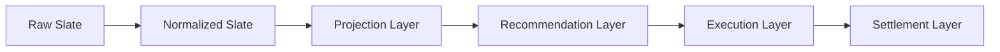

# IMMUTABLE_PIPELINE.md

Phase 3 — eliminating in-place mutation, incrementally.

**Mission reminder:** this phase is not about betting performance. No
probability, projection, Rule 71/81, bankroll sizing, calibration,
portfolio, execution, or ledger logic was changed. Production behavior
is identical before and after every commit in this phase — proven by
regression tests, not assumed.

---

## 1. Background

Phase 2's audit (`docs/MODEL_V2_ARCHITECTURE.md` §7) found that
`data/slate.json` is mutated in place by **ten** different scripts across
a single `fetch-slate.yml` run, with no schema boundary or immutable
checkpoint between any of them. This makes it impossible to inspect what
any one stage actually changed without diffing the whole file, and it's
the root cause of an entire class of bug (a later stage silently
assuming an earlier stage's output shape, as in the Phase 1 incident).

This phase does not eliminate that in one pass — the mission brief is
explicit: *"Do NOT rewrite the repository all at once. Introduce the
architecture incrementally. Maintain backwards compatibility wherever
practical. Prefer adapters over breaking changes."* What follows is what
was actually done, chosen specifically to be the safest available
incremental step, not the most complete one.

---

## 2. Target pipeline

Mapped onto the actual scripts in this repository:

| Layer | Scripts (current pipeline order) | Status this phase |
|---|---|---|
| **Raw Slate** | `api/slate.js` fetch → initial `data/slate.json` write | Unchanged — this is the input, not a mutator |
| **Normalized Slate** | `fetch_lineups.py` → `enrich_lineup_confirmed.py` → `post_fetch_gate.py` → `fetch_savant_pitchers.py` → `merge_odds.py` → `enrich_data.py` | **One script (`enrich_lineup_confirmed.py`) converted to immutable transform. One boundary artifact added** (`enrich_data.py` → `normalized_slate.json`, since it's the last step in this layer). Four scripts remain mutating. |
| **Projection Layer** | Embedded in `enrich_data.py` (offense baseline) and the start of `build_market_ledger.py` (`compute_projections`) | Not separated into its own artifact this phase — projections and recommendations are still computed and written together by `build_market_ledger.py`. Documented as future work (§6). |
| **Recommendation Layer** | `build_market_ledger.py` (populates `marketLedger`) | **One boundary artifact added** (`recommendations.json`). The script's internal evaluation logic (`evaluate_game()`) is untouched — far too large and load-bearing to safely refactor this phase. |
| **Execution Layer** | `protect_slate.py` → `risk_gate.py` → `write_pending_bets.py` → `validate_bet_logging.py` → `write_tracked_tickers.py` → `capture_closing_lines.py` | Untouched this phase — `risk_gate.py`'s in-place TT-downgrade mutation and `protect_slate.py`'s whole-file routing are both higher-risk, more central to real-money decisions, and were explicitly out of scope per the mission ("do not change... execution decisions"). |
| **Settlement Layer** | `clv_update.py` (root, separate `clv-update.yml` workflow) | Untouched — separate workflow, separate concern, not part of this pass. |

---

## 3. Artifact ownership map (this phase)

| Artifact | Path | Owner (writer) | Content | Status |
|---|---|---|---|---|
| Normalized Slate | `data/pipeline/<date>/normalized_slate.json` | `scripts/enrich_data.py` | Full slate object exactly as written to `data/slate.json` at that point in the pipeline | **New this phase** |
| Recommendations | `data/pipeline/<date>/recommendations.json` | `scripts/build_market_ledger.py` | Full slate object (including populated `marketLedger` per game) exactly as written to `data/slate.json` at that point | **New this phase** |
| Legacy working slate | `data/slate.json` | Still all ten scripts from Phase 2's audit | Unchanged in every way | Untouched |
| Authoritative slate | `data/slates/<date>/authoritative.json` | `protect_slate.py` (via `lib/slate_manager.py`) | Unchanged | Untouched — already its own immutable-ish artifact per Phase 2's findings, just not built on the same primitive introduced here |

Both new artifacts are written via the single shared primitive,
`lib/pipeline_artifacts.write_stage_artifact(stage, date, data)`
(`lib/pipeline_artifacts.py`), so any future stage that wants to publish
its own immutable checkpoint uses the same call, the same path
convention (`data/pipeline/<date>/<stage>.json`), and the same
try/except-wrapped, non-fatal safety posture.

**Why "full slate object" rather than a narrower per-stage schema?**
**Both `normalized_slate.json` and `recommendations.json` are explicitly
a transitional snapshot, not the final canonical schema.** Each is the
entire `data/slate.json` object at that point in the pipeline — full
projections, team stats, and (for `recommendations.json`) the populated
`marketLedger`, not a narrowed object containing only the fields that
layer conceptually owns. This is deliberate: these artifacts prove the
plumbing works and give real inspectable checkpoints today, without
requiring the larger schema-design effort `docs/CANONICAL_SCHEMAS.md`
(Phase 2) already scoped separately as Phase 4 work. No consumer should
treat either artifact as the narrower `Projection`/`Recommendation`
contract documented there — that materialization is future work, not
done here. `recommendations.json` in particular is named for the layer
boundary it marks (the point at which `marketLedger` becomes populated),
not as a claim that its contents are limited to recommendation data.

---

## 4. Scripts converted to immutable outputs

**One full conversion:** `scripts/enrich_lineup_confirmed.py`.

The per-game field computation (`lineupConfirmed`, `lineupSource`,
`lineupStatus`, `lineupCheckedAt`, `lineupAuditUsed`) was extracted,
unchanged, into a pure function `compute_game_lineup_fields(g, ...)` that
takes a game dict and returns new field values without reading from or
writing to `g`. `enrich_games_immutable(games, ...)` builds a **new**
list of game dicts (`{**g, **fields}` per game) instead of mutating each
game in the loop, and `main()` assembles a **new** slate object
(`{**slate, 'games': new_games}`) instead of mutating the loaded one.
The script still writes to the same `data/slate.json` path — the change
is entirely about *how* the new content is built, not *what* gets
written or *where*.

Chosen first because: it was the smallest of the ten confirmed mutators,
had a single well-isolated responsibility, and already had direct
existing test coverage (`tests/test_lineup_gate.py`,
`tests/test_phase1_lineup_fields.py`) to lean on as an independent
correctness check beyond this phase's own new tests.

**Two additive artifact snapshots (not full conversions):**
`scripts/enrich_data.py` and `scripts/build_market_ledger.py` — see §3.
Their internal mutation logic is untouched; they now also publish an
immutable copy of their output as a side effect.

---

## 5. Remaining mutable scripts

The other **eight** of the ten confirmed `data/slate.json` mutators are
unchanged this phase, each mapped to its layer above:

| Script | Layer | Why not converted this phase |
|---|---|---|
| `fetch_lineups.py` | Normalized Slate | External API calls (MLB boxscore) intertwined with the mutation — higher risk to extract cleanly in one pass |
| `post_fetch_gate.py` | Normalized Slate (quarantine) | Tightly coupled to `sys.exit()` control flow for the workflow's hard-fail gate; converting it changes how failure propagates, not just how data flows |
| `fetch_savant_pitchers.py` | Normalized Slate | External API calls; lower priority than the two enrichment scripts already handled |
| `merge_odds.py` | Normalized Slate | Not organized as a callable `main()` — a top-level script like `enrich_data.py`, but its odds-injection logic is denser and higher-stakes (feeds every market's pricing); deferred rather than risked in this pass |
| `validate_slate_final.py` | Recommendation Layer (execution-slip patch) | Patches `data/slate.json` as a secondary, best-effort side effect of building the execution slip — lower priority than the core `build_market_ledger.py` boundary already added |
| `protect_slate.py` | Execution Layer | Already implements its own artifact-routing state machine (`official_*`/`recheck_*`/`rejected_contaminated_*`/`authoritative.json`) via `lib/slate_manager.py` — arguably already "immutable-adjacent" in its own way; redesigning it is a larger, separate effort, not a candidate for this incremental pass |
| `risk_gate.py` | Execution Layer | Directly implements portfolio/TT-downgrade decisions — explicitly protected by the mission's "do not change... portfolio logic, execution decisions" |
| `write_pending_bets.py` | Execution Layer (reads only — does not write `data/slate.json`, listed for completeness since it's part of the same execution chain) | N/A — not a mutator of `data/slate.json`, included in Phase 2's list only as a boundary reference |

None of these were touched. Converting any of them is real future work,
sequenced in §7.

---

## 6. What was intentionally NOT done this phase

Per the mission's explicit "DO NOT" list:

- No ledger reconciliation (`data/bets.json` vs. root `bets.json` — that's Phase 2's own recommendation, untouched).
- No probability/projection redesign.
- No consolidation of the duplicate-logic findings from Phase 2's
  `docs/DUPLICATE_LOGIC_INVENTORY.md` beyond what was already done in
  that phase.
- No removal of any duplicate implementation as part of this refactor —
  the two scripts converted/instrumented this phase had no duplicate-logic
  findings against them in Phase 2's inventory, so this consideration
  didn't arise, but is noted here for completeness.
- No separation of the Projection Layer from the Recommendation Layer —
  both still happen inside/around `build_market_ledger.py`. Splitting them
  is real value (it would let you inspect "what did the model think"
  independent of "what did we recommend"), but requires understanding
  `evaluate_game()`'s ~1250 lines well enough to split it safely — not
  attempted here.

---

## 7. Recommended Phase 4 sequencing

1. Convert `merge_odds.py` to the immutable pattern (same technique as
   `enrich_lineup_confirmed.py`) — the next-safest candidate, since its
   transform is mechanical (structural odds injection) even though it's
   not yet organized as a callable function.
2. Split `build_market_ledger.py`'s projection computation from its
   recommendation/edge computation into two artifacts
   (`projections.json` / `recommendations.json`), now that the
   `recommendations.json` boundary already exists to build on top of.
3. Convert `fetch_lineups.py` and `fetch_savant_pitchers.py` — these need
   their external-API-call side effects separated from their pure
   data-shaping logic first (a small refactor in its own right) before
   the immutable-transform pattern can apply cleanly.
4. Only after 1–3: consider whether `risk_gate.py`'s portfolio decision
   logic can be expressed as a pure function of the Recommendation Layer
   artifact — this is the highest-value but also highest-risk conversion
   candidate, since it directly touches execution decisions, and should
   not be attempted until the lower-risk stages have proven the pattern
   out in production.
5. Revisit `protect_slate.py` / `lib/slate_manager.py`'s existing
   artifact-routing design and decide whether to unify it onto
   `lib/pipeline_artifacts.py`'s simpler primitive, or keep its own
   richer (official/recheck/rejected) versioning scheme as the more
   appropriate model for the authoritative slate specifically.

---

## 8. Tests added this phase

| File | Covers |
|---|---|
| `tests/test_pipeline_artifacts.py` (43 tests) | `lib/pipeline_artifacts.py` itself — path construction and path-traversal rejection, envelope shape/metadata, atomic-write mechanics (no stray temp files, interrupted-write simulation, malformed pre-existing artifact overwrite), and the full failure-isolation matrix (directory-creation failure, write failure, serialization failure, invalid date, repeated/parallel writes) |
| `tests/test_enrich_lineup_confirmed_immutable.py` (22 tests) | Golden-output regression for the full immutable conversion of `enrich_lineup_confirmed.py` — written and passed against the original mutate-in-place implementation first, then re-run unchanged after the refactor; plus game-status invariance (postponed/live/final/excluded), malformed-input tolerance, non-mutation and shallow-copy-boundary proof, idempotency, and game-ordering preservation |
| `tests/test_immutable_pipeline_snapshots.py` (7 tests) | Both additive snapshot points (`enrich_data.py`, `build_market_ledger.py`) — artifact content and metadata match the legacy write exactly; artifact-write failures never affect the primary write; artifact date follows the slate's own date rather than the wall clock; reruns overwrite rather than duplicate; the artifact's full-slate content is explicitly proven and documented as a transitional snapshot |

**72 new tests, all passing. Full suite: 749 passed, 5 skipped, 0
failed** (up from Phase 2's 677/5/0 baseline; this count reflects the
pre-merge hardening pass, not the original PR #4 submission).

---

## 9. Architecture-collision check (pre-merge hardening pass)

Compared `lib/pipeline_artifacts.py` against every other artifact-writing
or archival mechanism already in the repository:

| System | Date format | Write mechanism | Metadata fields | Collision? |
|---|---|---|---|---|
| `lib/pipeline_artifacts.py` (this PR) | `YYYY-MM-DD` | Atomic (temp file + `os.replace`, fsync'd) | `stage`, `slateDate`, `createdAt`, `schemaVersion`, `producedBy` | — |
| `lib/slate_manager.py` (`_write_json`, authoritative slate) | `YYYY-MM-DD` (`get_slate_dir`) | **Not atomic** — plain `open(path, "w")` | None (no envelope; raw slate content) | **Found: inconsistent atomicity.** Documented, not fixed — `slate_manager.py` writes the actual authoritative slate and is far higher-stakes than this PR's scope. Recommended as a Phase 4 follow-up, not touched here. |
| `data/pipeline_status.json` (`fetch-slate.yml`'s stage-status step) | N/A (single file, not per-date) | Shell `jq` + git commit (not atomic at the filesystem level, but committed to git which provides its own history) | `runId`, `slateDate`, `completedAt`, `status`, `stages` | **Found: `slateDate` naming — already fixed** (see below). `runId` is not present in this PR's artifacts — documented as a known gap, not added (would require threading the GitHub Actions run ID into two Python scripts that don't currently receive it; no current consumer needs it). |
| `data/slates/<date>/{official,recheck,rejected_contaminated}_<ts>.json` + `authoritative.json` | `YYYY-MM-DD` directory, `<ts>` suffix on versioned files | Not atomic (same `_write_json`) | None | Distinct directory (`data/slates/` vs `data/pipeline/`) and distinct purpose (authoritative-slate versioning vs. layer-boundary snapshots) — no path or ownership collision. `authoritative.json`'s "official/recheck/rejected" state machine is a **richer, different versioning model** than this PR's simple overwrite-on-rerun — intentionally not unified this phase (see §7 item 5). |

**Correction made as a direct result of this check:** the envelope's date
field was renamed from `date` to `slateDate` to match
`data/pipeline_status.json`'s existing convention — the same concept
(the slate's own date) should not have two different names across the
two artifact systems this repository now has. This is the "minimal
correction necessary to keep this foundation unambiguous" called for by
the pre-merge review; it does not touch `lib/slate_manager.py` or
`data/pipeline_status.json` themselves.

**No conflicting ownership, ambiguous authoritative status, or path
collisions were found.** `lib/pipeline_artifacts.py`'s artifacts
(`data/pipeline/<date>/*.json`) and `lib/slate_manager.py`'s artifacts
(`data/slates/<date>/*.json`) live in disjoint directories, serve
disjoint purposes (transitional layer-boundary snapshots vs. the
authoritative slate's own versioning), and neither claims to be
authoritative over the other. No current script reads either of the two
new artifacts as authoritative — `data/slate.json` and
`data/slates/<date>/authoritative.json` remain the only things any
consumer actually treats as such.

**Not fixed, documented only:** `lib/slate_manager.py`'s non-atomic write
of the authoritative slate. This is a real, independently-existing gap
(not introduced by this PR) that this review surfaced by comparison —
recommended for a dedicated future pass given how much higher-stakes that
file's write path is, not addressed here per the explicit instruction not
to perform a broad unification in this PR.

---

## 10. Shallow-copy contract (documented this pass)

`enrich_lineup_confirmed.py`'s immutable conversion builds a **new
top-level** game dict per game (`{**g, **fields}`), but this is a
**shallow** copy — nested values the stage doesn't own (e.g.
`awayTeamStats`) are the exact same object, by reference, as the input's.
This is safe under this stage's own contract (it never mutates those
nested objects — proven by
`tests/test_enrich_lineup_confirmed_immutable.py`'s
`TestNonMutationAndIdempotency` class), but any **future** stage adopting
this same pattern must not assume its output's nested dicts are
independent from its input's. Deep-copying every nested structure on
every stage transform was considered and rejected for this phase as
complexity without a real current need — no existing caller violates the
read-only contract — but this is exactly the kind of assumption that
should be revisited if/when `merge_odds.py` or `risk_gate.py` (both of
which DO mutate nested team-stat blocks) are converted in Phase 4.
