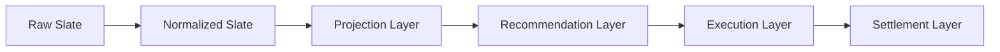

# IMMUTABLE_PIPELINE.md

Phases 3–4 — eliminating in-place mutation, incrementally. Sections below
are annotated "(Phase 3)" or "(Phase 4)" where the distinction matters;
unmarked content still reflects the current state of the pipeline.

**Mission reminder:** neither phase is about betting performance. No
probability, projection, edge calculation, Rule 71/81, bankroll sizing,
calibration, portfolio, execution, or ledger logic was changed in either
phase. Production behavior is identical before and after every commit —
proven by regression tests, not assumed.

---

## 1. Background

Phase 2's audit (`docs/MODEL_V2_ARCHITECTURE.md` §7) found that
`data/slate.json` is mutated in place by **ten** different scripts across
a single `fetch-slate.yml` run, with no schema boundary or immutable
checkpoint between any of them. This makes it impossible to inspect what
any one stage actually changed without diffing the whole file, and it's
the root cause of an entire class of bug (a later stage silently
assuming an earlier stage's output shape, as in the Phase 1 incident).

This phase does not eliminate that in one pass — the mission brief is
explicit: *"Do NOT rewrite the repository all at once. Introduce the
architecture incrementally. Maintain backwards compatibility wherever
practical. Prefer adapters over breaking changes."* What follows is what
was actually done, chosen specifically to be the safest available
incremental step, not the most complete one.

---

## 2. Target pipeline

Mapped onto the actual scripts in this repository:

| Layer | Scripts (current pipeline order) | Status |
|---|---|---|
| **Raw Slate** | `api/slate.js` fetch → initial `data/slate.json` write | Unchanged — this is the input, not a mutator |
| **Normalized Slate** | `fetch_lineups.py` → `enrich_lineup_confirmed.py` → `post_fetch_gate.py` → `fetch_savant_pitchers.py` → `merge_odds.py` → `enrich_data.py` | **Two scripts now converted to immutable transforms** (`enrich_lineup_confirmed.py` in Phase 3, `merge_odds.py` in Phase 4 — see §4). **One boundary artifact** (`enrich_data.py` → `normalized_slate.json`, Phase 3). Three scripts (`fetch_lineups.py`, `post_fetch_gate.py`, `fetch_savant_pitchers.py`) remain mutating. |
| **Projection Layer** | `compute_projections()` inside `scripts/build_market_ledger.py` | **(Phase 4) Boundary artifact added**: `projections.json`, snapshotting `compute_projections()`'s output for every game before any recommendation decision is made. The function itself was not moved or rewritten — see §3 for why this specific point is the boundary and §6 for why it's a *narrowed*, canonical artifact rather than a transitional full-slate one. |
| **Recommendation Layer** | `build_market_ledger.py` (populates `marketLedger`) | **Boundary artifact** (`recommendations.json`, Phase 3, metadata clarified Phase 4 — see §3). The script's internal evaluation logic (`evaluate_game()`) is untouched in both phases — far too large and load-bearing to safely refactor. |
| **Execution Layer** | `protect_slate.py` → `risk_gate.py` → `write_pending_bets.py` → `validate_bet_logging.py` → `write_tracked_tickers.py` → `capture_closing_lines.py` | Untouched in both phases — `risk_gate.py`'s in-place TT-downgrade mutation and `protect_slate.py`'s whole-file routing are both higher-risk, more central to real-money decisions, and explicitly out of scope per the mission ("do not change... execution decisions"). See §11 for why `risk_gate.py` specifically remains deferred. |
| **Settlement Layer** | `clv_update.py` (root, separate `clv-update.yml` workflow) | Untouched — separate workflow, separate concern, not part of either pass. |

---

## 3. Artifact ownership map

| Artifact | Path | Owner (writer) | Content | Status | Metadata `status` / `sourceStage` |
|---|---|---|---|---|---|
| Normalized Slate | `data/pipeline/<date>/normalized_slate.json` | `scripts/enrich_data.py` | Full slate object exactly as written to `data/slate.json` at that point in the pipeline | Phase 3 | `"canonical"` (default — predates the `status` field, never explicitly re-labeled since it is, in fact, the intended contract for this stage today) / `null` |
| **Projections** | `data/pipeline/<date>/projections.json` | `scripts/build_market_ledger.py` (`compute_projections()` snapshot, before `evaluate_game()`'s per-game loop) | **Narrowed** per-game array: `away`, `home`, `kalshiKey`, `awayProjRuns`, `homeProjRuns`, `totalProj`, `f5AwayProj`, `f5HomeProj`, `missingFields`, `excludedFromSlate` — nothing else | **New in Phase 4** | `"canonical"` / `"normalized_slate"` |
| Recommendations | `data/pipeline/<date>/recommendations.json` | `scripts/build_market_ledger.py` | Full slate object (including populated `marketLedger` per game) exactly as written to `data/slate.json` at that point | Phase 3, metadata clarified Phase 4 | `"transitional"` (explicit as of Phase 4 — see below) / `"projections"` |
| Legacy working slate | `data/slate.json` | Still all ten scripts from Phase 2's audit | Unchanged in every way | Untouched | N/A |
| Authoritative slate | `data/slates/<date>/authoritative.json` | `protect_slate.py` (via `lib/slate_manager.py`) | Unchanged | Untouched — already its own immutable-ish artifact per Phase 2's findings, just not built on the same primitive introduced here | N/A |

All three pipeline artifacts are written via the single shared primitive,
`lib/pipeline_artifacts.write_stage_artifact(stage, date, data,
produced_by=None, status="canonical", source_stage=None)`
(`lib/pipeline_artifacts.py`), so any future stage that wants to publish
its own immutable checkpoint uses the same call, the same path
convention (`data/pipeline/<date>/<stage>.json`), and the same
try/except-wrapped, non-fatal safety posture. `status` and `source_stage`
are Phase 4 additions to the envelope (see `lib/pipeline_artifacts.py`'s
module docstring) — both optional, both defaulting to values that leave
every Phase 3 caller's behavior unchanged.

**Why is `projections.json` narrowed but `recommendations.json` still
the full slate?** This is a direct, code-derived consequence of how each
artifact is produced, not an arbitrary choice:

- `compute_projections(g)` is a small, pure function of a handful of
  input fields (`awayTeamStats.offenseBaselineAdj`,
  `away.pitcherSavant.xFIP`, `away.bullpen.xFIP`, `park.parkFactor`, and
  their home-side equivalents) that returns exactly five values
  (`away_proj, home_proj, f5_away, f5_home, missing_fields`). Building a
  narrow artifact from its output required zero extraction risk — the
  function already returns precisely the payload the artifact needs, so
  `projections.json` is written as `status: "canonical"`: this genuinely
  is the intended schema for the Projection Layer, not a placeholder.
- `evaluate_game(g)`, by contrast, builds each market row (`marketLedger`
  entries) by reading and threading through dozens of fields from the
  full game object — team stats, lineup-confirmation fields, Kalshi
  prices, pitcher Savant data — that live alongside, not inside, the
  eleven `marketLedger` rows it produces. Narrowing `recommendations.json`
  to just `marketLedger` would require verifying every current and future
  downstream reader only needs those eleven rows and nothing else from
  the game object — a real schema-design effort
  (`docs/CANONICAL_SCHEMAS.md`, scoped by Phase 2) that risks breaking
  behavior if rushed. Per the Phase 4 mission's explicit instruction not
  to narrow this artifact if doing so "requires a broad
  `build_market_ledger.py` rewrite," it remains the full slate object,
  now explicitly labeled `status: "transitional"` in its own metadata
  (previously this was documented only in prose, in this file) so a
  reader inspecting the artifact directly — without first reading this
  doc — still gets the signal.

**What belongs in `recommendations.json` and what doesn't (Phase 4
clarification):** the artifact's name describes the *layer boundary* it
marks (the point where `marketLedger` — one row per required market,
with `status`/`edge`/`confidence`/`rejectionReason` — becomes populated),
not a promise that its contents are limited to recommendation data (they
aren't, per the above). To remove any ambiguity about what a
"recommendation" is in this pipeline, restated explicitly:

- **Projections are inputs to a recommendation, not recommendations
  themselves.** `awayProjRuns`/`homeProjRuns`/`f5AwayProj`/`f5HomeProj`
  answer "what does the model think will happen"; they carry no
  accept/reject verdict and are unaffected by Kalshi pricing, calibration,
  or gates. `projections.json`'s `sourceStage: "normalized_slate"`
  reflects that projections are computed from the normalized slate,
  independent of any market or recommendation logic.
- **Recommendations are the `marketLedger` rows themselves** — each row's
  `status` (`Accepted`/`Rejected`/`Missing Data`/`Evaluation Failed`),
  `edge`, `confidence`, and `rejectionReason` are `evaluate_game()`'s
  actual output. This is the only data `recommendations.json` is named
  for; everything else riding along in the full-slate snapshot is
  transitional baggage documented above, not part of the "recommendation"
  concept.
- **Execution decisions are not recommendations.** Whether a recommended
  bet is actually placed — position sizing after portfolio concentration
  checks, `risk_gate.py`'s TT-downgrade logic, `protect_slate.py`'s
  official/recheck routing — happens strictly after
  `build_market_ledger.py` returns, in the Execution Layer (§2), and none
  of it is captured by either `projections.json` or
  `recommendations.json`. `risk_gate.py` in particular was not touched
  this phase (§11) and does not write to either pipeline artifact.
- **Risk-gate results are not recommendation generation.** Rule
  71/81-style suspensions that are already baked into
  `evaluate_game()`'s own logic (e.g. the RL/Game_Total paper-only
  suspensions) are part of recommendation generation because they
  determine the row's `status`/`confidence` directly; `risk_gate.py`'s
  separate, later portfolio-level gate is a distinct concern applied
  after recommendations already exist, and is out of scope for both
  artifacts.
- **Ledger settlement data doesn't belong here.** CLV/closing-price
  fields (`closingPrice`, `clvVsSnapshot`, etc.) exist as `null`
  placeholders in each `marketLedger` row's schema (see
  `make_row()`/`build_edge_fields()` in `scripts/build_market_ledger.py`)
  but are only ever populated later, by the Settlement Layer's
  `clv_update.py` — a completely separate workflow. Neither pipeline
  artifact is re-written when settlement happens; both remain frozen
  snapshots of the moment they were produced.

---

## 4. Scripts converted to immutable outputs

**Two full conversions:** `scripts/enrich_lineup_confirmed.py` (Phase 3)
and `scripts/merge_odds.py` (Phase 4).

### `enrich_lineup_confirmed.py` (Phase 3)

The per-game field computation (`lineupConfirmed`, `lineupSource`,
`lineupStatus`, `lineupCheckedAt`, `lineupAuditUsed`) was extracted,
unchanged, into a pure function `compute_game_lineup_fields(g, ...)` that
takes a game dict and returns new field values without reading from or
writing to `g`. `enrich_games_immutable(games, ...)` builds a **new**
list of game dicts (`{**g, **fields}` per game) instead of mutating each
game in the loop, and `main()` assembles a **new** slate object
(`{**slate, 'games': new_games}`) instead of mutating the loaded one.
The script still writes to the same `data/slate.json` path — the change
is entirely about *how* the new content is built, not *what* gets
written or *where*.

Chosen first because: it was the smallest of the ten confirmed mutators,
had a single well-isolated responsibility, and already had direct
existing test coverage (`tests/test_lineup_gate.py`,
`tests/test_phase1_lineup_fields.py`) to lean on as an independent
correctness check beyond this phase's own new tests.

### `merge_odds.py` (Phase 4)

Unlike `enrich_lineup_confirmed.py`, this script has no `main()` — it is
a top-level script that executes its full logic (data loads, per-game
matching/injection loop, `data/slate.json` write, diagnostic prints) at
import/run time. The per-game odds/Kalshi-injection logic was extracted
into `compute_game_odds_fields(game, odds_games, registry, rfi_by_key)`,
a pure function returning `(new_game, matched, unmatched_label,
log_lines)` — a **new** game dict, never a mutation of the input.
`merge_odds_immutable(slate, odds_games, registry, rfi_by_key)` then
builds a **new** slate object the same way `enrich_games_immutable()`
does. The top-level script body was reduced to: load inputs (unchanged
error-handling for each — `data/odds.json` still crashes uncaught if
missing/malformed, `data/slate.json` still exits(1) on parse failure,
the registry/`kalshi_raw.json`/`kalshi_search.json` reads keep their
original tolerant fallbacks), call `merge_odds_immutable()`, print the
returned `log_lines` in the same order they were previously printed
inline, write the result to `data/slate.json`, then run the unchanged
diagnostic-summary block against the new slate. CLI invocation
(`python3 scripts/merge_odds.py`) and every file path are unchanged —
`.github/workflows/fetch-slate.yml` did not need to change.

**One purity fix found and corrected as a byproduct, not a behavior
change:** the pre-refactor code aliased `game['odds']` directly to the
matched `data/odds.json` entry's `books` dict (`game['odds'] =
best.get('books', {})`), then mutated its `kalshi` sub-block in place via
`.setdefault('kalshi', {})`. In this codebase that specific aliasing
never produced observably wrong output — `find_registry_entry()` is a
pure function of the matched entry's own team names, so even if two
slate games somehow matched the same `data/odds.json` entry, both would
deterministically recompute identical Kalshi data — but it did mean
`merge_odds.py` mutated the parsed `data/odds.json` structure as a side
effect of populating `data/slate.json`, which is exactly the kind of
caller-owned-object mutation this conversion exists to eliminate. The
immutable version copies (`dict(...)`) both `books` and its nested
`kalshi` block before writing into them, preserving any pre-existing
kalshi-native content (see the `TestPreExistingKalshiBooksPreserved` test
class) without ever aliasing the input.

Golden-equivalence method: `tests/test_merge_odds_immutable.py` (21
tests) was written and run against the **original** implementation
first, covering complete/missing/partial market coverage, sentinel and
null prices, malformed-but-tolerated inputs, game-status invariance
(postponed/live/final/excluded), the pre-existing-`kalshi`-block
preservation scenario, `pinVigFree` removal, multi-game ordering, and
idempotency — then re-run **unchanged** after the refactor, all 21 still
passing. The pre-existing `tests/test_rfi_fallback.py` (25 tests,
including its fragile source-text extraction of `_american_from_mid`/
`_build_rfi_from_ks_market`, which remain textually untouched) also still
passes unchanged.

**Additive artifact snapshots (not full conversions):**
`scripts/enrich_data.py` (Phase 3) and `scripts/build_market_ledger.py`
(Phase 3 for `recommendations.json`, Phase 4 for `projections.json`) —
see §3. Their internal mutation/evaluation logic is untouched; they now
also publish one or more immutable copies of parts of their output as a
side effect.

---

## 5. Remaining mutable scripts

**Seven** of the ten confirmed `data/slate.json` mutators are still
unconverted as of Phase 4 (`merge_odds.py` moved from this list into §4
this phase), each mapped to its layer above:

| Script | Layer | Why not converted yet |
|---|---|---|
| `fetch_lineups.py` | Normalized Slate | External API calls (MLB boxscore) intertwined with the mutation — higher risk to extract cleanly in one pass |
| `post_fetch_gate.py` | Normalized Slate (quarantine) | Tightly coupled to `sys.exit()` control flow for the workflow's hard-fail gate; converting it changes how failure propagates, not just how data flows |
| `fetch_savant_pitchers.py` | Normalized Slate | External API calls; lower priority than the enrichment scripts already handled |
| `validate_slate_final.py` | Recommendation Layer (execution-slip patch) | Patches `data/slate.json` as a secondary, best-effort side effect of building the execution slip — lower priority than the core `build_market_ledger.py` boundaries already added |
| `protect_slate.py` | Execution Layer | Already implements its own artifact-routing state machine (`official_*`/`recheck_*`/`rejected_contaminated_*`/`authoritative.json`) via `lib/slate_manager.py` — arguably already "immutable-adjacent" in its own way; redesigning it is a larger, separate effort, not a candidate for this incremental pass |
| `risk_gate.py` | Execution Layer | Directly implements portfolio/TT-downgrade decisions — explicitly protected by the mission's "do not change... portfolio logic, execution decisions" in both phases. See §11 for the fuller reasoning on why this specific script stays deferred. |
| `write_pending_bets.py` | Execution Layer (reads only — does not write `data/slate.json`, listed for completeness since it's part of the same execution chain) | N/A — not a mutator of `data/slate.json`, included in Phase 2's list only as a boundary reference |

None of these were touched in Phase 3 or Phase 4. Converting any of them
is real future work, sequenced in §7.

---

## 6. What was intentionally NOT done

Per each phase's explicit "DO NOT" list:

- No ledger reconciliation (`data/bets.json` vs. root `bets.json` — that's Phase 2's own recommendation, still untouched).
- No probability/projection/pricing/edge-calculation redesign, in either phase.
- No consolidation of the duplicate-logic findings from Phase 2's
  `docs/DUPLICATE_LOGIC_INVENTORY.md` beyond what was already done in
  that phase.
- No removal of any duplicate implementation as part of either refactor —
  none of the scripts converted/instrumented across Phase 3 or Phase 4
  had duplicate-logic findings against them in Phase 2's inventory, so
  this consideration didn't arise, but is noted here for completeness.
- **(Phase 4) Partial, not full, separation of the Projection Layer from
  the Recommendation Layer.** `projections.json` (§3) now gives an
  independently inspectable snapshot of "what did the model think,"
  separate from "what did we recommend" — but this is a snapshot, not a
  structural split. `evaluate_game()` still computes recommendations by
  calling `compute_projections()` internally exactly as before; the two
  computations are not decoupled inside `build_market_ledger.py` itself,
  and `evaluate_game()`'s ~1250 lines of edge/confidence/gate logic were
  not touched, reorganized, or reduced. A true structural split — where
  `build_market_ledger.py` reads `projections.json` as its input rather
  than recomputing projections itself — is real future work (§7), not
  attempted here because it would require rewriting `evaluate_game()`'s
  call sites, which risks the exact kind of behavior change both phases'
  missions explicitly forbid.
- **(Phase 4) No narrowing of `recommendations.json`.** Per the mission's
  explicit instruction, it remains the full-slate transitional snapshot
  it was in Phase 3 — only its metadata was clarified (`status:
  "transitional"`, `sourceStage: "projections"`), not its shape. See §3
  for the full reasoning.
- **(Phase 4) No changes to `risk_gate.py`.** See §11.

---

## 7. Recommended Phase 5 sequencing

Items 1 and 2 from the original Phase 4 sequencing plan are now done
(`merge_odds.py` conversion, §4; `projections.json` boundary, §3). What
remains:

1. Convert `fetch_lineups.py` and `fetch_savant_pitchers.py` — these need
   their external-API-call side effects separated from their pure
   data-shaping logic first (a small refactor in its own right) before
   the immutable-transform pattern can apply cleanly.
2. Convert `post_fetch_gate.py` — requires deciding how its
   `sys.exit()`-based hard-fail gate should interact with a pure-transform
   return value instead of an in-place mutation plus process exit; this
   is a control-flow design question, not just a data-shape one.
3. Structurally split `build_market_ledger.py` so it *reads*
   `projections.json` as an input rather than recomputing
   `compute_projections()` internally inside `evaluate_game()` — turning
   Projection/Recommendation from "two snapshots of one monolithic
   function" (current state) into "two actually decoupled stages." This
   requires understanding `evaluate_game()`'s ~1250 lines well enough to
   thread projections through as a parameter without changing any of its
   edge/confidence/gate outputs — not attempted in Phase 4 for exactly
   that risk.
4. Only after 1–3: consider whether `risk_gate.py`'s portfolio decision
   logic can be expressed as a pure function of the Recommendation Layer
   artifact — this is the highest-value but also highest-risk conversion
   candidate, since it directly touches execution decisions, and should
   not be attempted until the lower-risk stages have proven the pattern
   out in production. See §11 for why this was deferred again in Phase 4
   specifically.
5. Revisit `protect_slate.py` / `lib/slate_manager.py`'s existing
   artifact-routing design and decide whether to unify it onto
   `lib/pipeline_artifacts.py`'s simpler primitive, or keep its own
   richer (official/recheck/rejected) versioning scheme as the more
   appropriate model for the authoritative slate specifically.
6. Once `recommendations.json` no longer needs to carry the full slate
   (a consequence of item 3), revisit narrowing it to just the
   `marketLedger` rows per game, retiring its `status: "transitional"`
   label in favor of `"canonical"` — this was explicitly deferred again
   in Phase 4 (§3, §6) because it depends on item 3 happening first.

---

## 8. Tests added

### Phase 3

| File | Covers |
|---|---|
| `tests/test_pipeline_artifacts.py` (43 tests) | `lib/pipeline_artifacts.py` itself — path construction and path-traversal rejection, envelope shape/metadata, atomic-write mechanics (no stray temp files, interrupted-write simulation, malformed pre-existing artifact overwrite), and the full failure-isolation matrix (directory-creation failure, write failure, serialization failure, invalid date, repeated/parallel writes) |
| `tests/test_enrich_lineup_confirmed_immutable.py` (22 tests) | Golden-output regression for the full immutable conversion of `enrich_lineup_confirmed.py` — written and passed against the original mutate-in-place implementation first, then re-run unchanged after the refactor; plus game-status invariance (postponed/live/final/excluded), malformed-input tolerance, non-mutation and shallow-copy-boundary proof, idempotency, and game-ordering preservation |
| `tests/test_immutable_pipeline_snapshots.py` (7 tests) | Both additive snapshot points (`enrich_data.py`, `build_market_ledger.py`) — artifact content and metadata match the legacy write exactly; artifact-write failures never affect the primary write; artifact date follows the slate's own date rather than the wall clock; reruns overwrite rather than duplicate; the artifact's full-slate content is explicitly proven and documented as a transitional snapshot |

72 new tests, all passing. Full suite at Phase 3 merge: 749 passed, 5
skipped, 0 failed (up from Phase 2's 677/5/0 baseline).

### Phase 4

| File | New tests | Covers |
|---|---|---|
| `tests/test_merge_odds_immutable.py` | 21 (new file) | Golden-equivalence regression for the `merge_odds.py` immutable conversion (§4) — written and run against the original implementation first, then re-run unchanged after the refactor. Complete odds coverage, missing book/Kalshi data, partial market availability, sentinel/null prices, malformed-but-tolerated inputs, pre-existing `books.kalshi` preservation (the `api/odds.js` interaction — see §4), `pinVigFree` removal, game-status invariance, multi-game ordering, idempotency |
| `tests/test_pipeline_artifacts.py` | +4 (47 total) | The new optional `status`/`source_stage` kwargs on `write_stage_artifact()` — default to `"canonical"`/`None`, can be set explicitly, round-trip correctly through `read_stage_artifact()` |
| `tests/test_immutable_pipeline_snapshots.py` | +9 (16 total) | The new `projections.json` artifact (`TestBuildMarketLedgerProjectionsSnapshot`) — content matches `compute_projections()`'s own output exactly, `status`/`sourceStage` metadata is `"canonical"`/`"normalized_slate"`, a quarantined (`excludedFromSlate`) game still gets a projection row, reruns overwrite in place, and the full Part 6 failure-isolation matrix at the script-integration level: a projections-write failure breaks neither the legacy `data/slate.json` write nor the independent `recommendations.json` artifact; an invalid slate date fails both artifact writes cleanly without breaking the legacy write or touching `data/bets.json`/`data/slates/<date>/authoritative.json` (explicitly proven present-but-untouched, not just absent); a normal run also leaves those two files untouched; a malformed pre-existing `projections.json` is cleanly overwritten; and a simulated mid-write crash (`os.fdopen` failure) leaves no partial `projections.json` behind while the later recommendations/legacy writes still complete. One pre-existing test in this file was updated (not just left passing) — the rerun test's `os.listdir()` assertion now expects both `projections.json` and `recommendations.json` in the date directory, since `main()` now writes both. |

34 new tests, all passing (existing `tests/test_rfi_fallback.py`'s 25
tests also re-verified passing unchanged, per §4). **Full `tests/` suite
at Phase 4: 783 passed, 5 skipped, 0 failed.**

---

## 9. Architecture-collision check (pre-merge hardening pass)

Compared `lib/pipeline_artifacts.py` against every other artifact-writing
or archival mechanism already in the repository:

| System | Date format | Write mechanism | Metadata fields | Collision? |
|---|---|---|---|---|
| `lib/pipeline_artifacts.py` (this PR) | `YYYY-MM-DD` | Atomic (temp file + `os.replace`, fsync'd) | `stage`, `slateDate`, `createdAt`, `schemaVersion`, `producedBy` | — |
| `lib/slate_manager.py` (`_write_json`, authoritative slate) | `YYYY-MM-DD` (`get_slate_dir`) | **Not atomic** — plain `open(path, "w")` | None (no envelope; raw slate content) | **Found: inconsistent atomicity.** Documented, not fixed in Phase 3 — `slate_manager.py` writes the actual authoritative slate and was far higher-stakes than that PR's scope. Still not fixed as of Phase 4 (see §7 item 5) — `projections.json`'s introduction did not touch this gap; it uses the same atomic primitive as every other `lib/pipeline_artifacts.py` caller. |
| `data/pipeline_status.json` (`fetch-slate.yml`'s stage-status step) | N/A (single file, not per-date) | Shell `jq` + git commit (not atomic at the filesystem level, but committed to git which provides its own history) | `runId`, `slateDate`, `completedAt`, `status`, `stages` | **Found: `slateDate` naming — already fixed** (see below). `runId` is not present in this PR's artifacts — documented as a known gap, not added (would require threading the GitHub Actions run ID into two Python scripts that don't currently receive it; no current consumer needs it). |
| `data/slates/<date>/{official,recheck,rejected_contaminated}_<ts>.json` + `authoritative.json` | `YYYY-MM-DD` directory, `<ts>` suffix on versioned files | Not atomic (same `_write_json`) | None | Distinct directory (`data/slates/` vs `data/pipeline/`) and distinct purpose (authoritative-slate versioning vs. layer-boundary snapshots) — no path or ownership collision. `authoritative.json`'s "official/recheck/rejected" state machine is a **richer, different versioning model** than this PR's simple overwrite-on-rerun — intentionally not unified this phase (see §7 item 5). |

**Correction made as a direct result of this check:** the envelope's date
field was renamed from `date` to `slateDate` to match
`data/pipeline_status.json`'s existing convention — the same concept
(the slate's own date) should not have two different names across the
two artifact systems this repository now has. This is the "minimal
correction necessary to keep this foundation unambiguous" called for by
the pre-merge review; it does not touch `lib/slate_manager.py` or
`data/pipeline_status.json` themselves.

**No conflicting ownership, ambiguous authoritative status, or path
collisions were found.** `lib/pipeline_artifacts.py`'s artifacts
(`data/pipeline/<date>/*.json`) and `lib/slate_manager.py`'s artifacts
(`data/slates/<date>/*.json`) live in disjoint directories, serve
disjoint purposes (transitional layer-boundary snapshots vs. the
authoritative slate's own versioning), and neither claims to be
authoritative over the other. No current script reads either of the two
new artifacts as authoritative — `data/slate.json` and
`data/slates/<date>/authoritative.json` remain the only things any
consumer actually treats as such.

**Not fixed, documented only:** `lib/slate_manager.py`'s non-atomic write
of the authoritative slate. This is a real, independently-existing gap
(not introduced by this PR) that this review surfaced by comparison —
recommended for a dedicated future pass given how much higher-stakes that
file's write path is, not addressed here per the explicit instruction not
to perform a broad unification in this PR.

---

## 10. Shallow-copy contract

`enrich_lineup_confirmed.py`'s immutable conversion (Phase 3) builds a
**new top-level** game dict per game (`{**g, **fields}`), but this is a
**shallow** copy — nested values the stage doesn't own (e.g.
`awayTeamStats`) are the exact same object, by reference, as the input's.
This is safe under this stage's own contract (it never mutates those
nested objects — proven by
`tests/test_enrich_lineup_confirmed_immutable.py`'s
`TestNonMutationAndIdempotency` class), but any **future** stage adopting
this same pattern must not assume its output's nested dicts are
independent from its input's. Deep-copying every nested structure on
every stage transform was considered and rejected as complexity without
a real current need — no existing caller violates the read-only contract.

**(Phase 4) `merge_odds.py`'s conversion follows the same contract, with
one addition specific to its own shape.** `compute_game_odds_fields()`
(§4) shallow-copies the game dict the same way, but because this script's
own job is specifically to *write* into a nested block
(`game['odds']['kalshi']`) rather than merely read from one, it also
copies that nested `odds` dict and its `kalshi` sub-dict before writing
into them — this is what fixed the aliasing byproduct described in §4.
Every other nested value on the game object (team stats, lineup fields,
etc.) that `merge_odds.py` doesn't itself write remains a shared
reference with the input, same as `enrich_lineup_confirmed.py`'s
contract. The general principle holds: **a stage only needs to copy the
nested structures it itself writes into; anything it only reads can
safely remain shared, provided it's never mutated.**

`risk_gate.py` is the one remaining script in the pipeline confirmed
(Phase 2's audit) to mutate nested team-stat/TT-downgrade blocks in
place, and it has not been converted in either phase — see §11 for why.
If/when it is converted, its own writes will need the same "copy only
what you write into" treatment `merge_odds.py` now demonstrates.

---

## 11. Why `risk_gate.py` remains deferred

`risk_gate.py` was explicitly out of scope for both Phase 3 and Phase 4,
per each phase's mission ("do not change... portfolio logic, execution
decisions"; "do not modify risk_gate.py"). Beyond simply following that
instruction, there are concrete reasons this script specifically — more
than any other remaining mutator — should not be converted until the
lower-risk stages have proven the pattern out:

1. **It is the last decision point before real money moves.** Every
   other conversion in Phase 3/4 (`enrich_lineup_confirmed.py`,
   `merge_odds.py`, the `projections.json`/`recommendations.json`
   artifacts) touches data that *informs* a recommendation.
   `risk_gate.py` is the first script in the pipeline whose output
   directly gates whether an already-Accepted recommendation actually
   gets executed (portfolio concentration limits, TT-downgrade rules). A
   subtle behavior change here — even one that "looks" purity-preserving,
   like the aliasing fix `merge_odds.py` got for free — has a
   fundamentally different blast radius than the same category of change
   anywhere earlier in the pipeline.
2. **It mutates nested blocks the other converted stages only read.**
   `enrich_lineup_confirmed.py` and `merge_odds.py` each write into a
   block they themselves own (lineup fields; `odds.kalshi`).
   `risk_gate.py`'s TT-downgrade logic reaches into and modifies
   `marketLedger` rows that `build_market_ledger.py` — a different
   script — already built. Converting it safely requires the same
   "copy only what you write into" discipline (§10), but applied across
   a stage boundary that doesn't cleanly separate "my data" from
   "someone else's data" the way the two completed conversions did.
3. **The pattern needed one more real-world validation cycle.** Phase 3
   converted one script; Phase 4 converted a second, structurally
   different one (no `main()`, denser per-game logic, an
   already-identified aliasing subtlety) and added a genuinely narrowed
   artifact rather than another full-slate snapshot. Both moves were
   deliberately chosen as the *next-safest* increment, not the most
   valuable one — `risk_gate.py` is next in line specifically because
   the two lower-risk precedents now exist to build its conversion on
   top of, not because it's now considered low-risk itself.

---

## 12. Remaining path toward a fully immutable pipeline

Combining §5, §6, and §7: as of Phase 4, **three** of the ten
Phase-2-confirmed `data/slate.json` mutators are fully converted
(`enrich_lineup_confirmed.py`, `merge_odds.py`) or have a boundary
artifact published alongside their unchanged mutation
(`enrich_data.py` → `normalized_slate.json`, `build_market_ledger.py` →
`projections.json` + `recommendations.json`). The remaining path:

1. Two API-call scripts (`fetch_lineups.py`, `fetch_savant_pitchers.py`)
   need their I/O separated from their data-shaping logic before they
   can be converted at all.
2. One control-flow script (`post_fetch_gate.py`) needs a design decision
   about how a hard-fail gate expresses itself as a pure transform rather
   than a mutation-plus-`sys.exit()`.
3. `build_market_ledger.py` needs a structural (not just additive) split
   so `evaluate_game()` consumes `projections.json` as an input instead
   of recomputing it — only after this does narrowing
   `recommendations.json` to just `marketLedger` become low-risk.
4. `risk_gate.py` and `protect_slate.py` are the two Execution Layer
   scripts still fully out of scope — §11 covers why `risk_gate.py`
   specifically stays deferred; `protect_slate.py`'s existing
   official/recheck/rejected versioning scheme (via `lib/slate_manager.py`)
   is a separate, already-immutable-adjacent design that needs its own
   unify-or-keep decision (§7 item 5), not a straightforward conversion.
5. Only once all of the above are done would every stage in the Target
   Pipeline (§2) have both an immutable transform *and* a canonical
   (non-transitional) artifact — at which point `data/slate.json` itself
   could, in principle, be retired in favor of consumers reading each
   stage's own artifact directly. That end state is not close: it is the
   long-run destination this incremental approach is walking toward, not
   a near-term deliverable of any single future phase.
