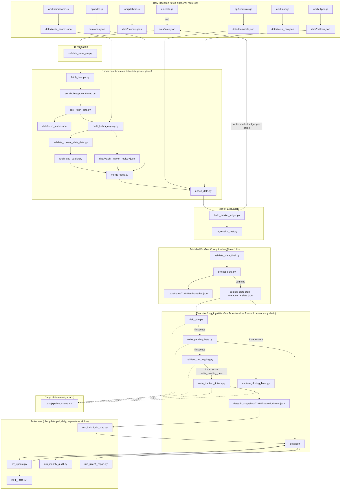

# MODEL_V2_ARCHITECTURE.md

Phase 2, Part 1 — complete repository architecture map.

Scope note: this document describes the system **as it exists on `main`
after the Phase 1 pipeline-reliability merge** (PR #2, merge commit
`341a6f7`). No probability models, projections, Rule 71/81, bankroll
sizing, calibration, portfolio logic, execution decisions, or ledger
contents were changed to produce this document. It is pure inventory.

---

## 1. Directory map

| Directory | Contents | Role |
|---|---|---|
| `api/` | 10 Vercel serverless functions (`slate.js`, `odds.js`, `kalshi.js`, `kalshisearch.js`, `enrich.js`, `teamstats.js`, `pitchers.js`, `bullpen.js`, `savant.js`, `weather.js`) | Live data-fetch layer — every one is an HTTP endpoint hit by `fetch-slate.yml` via `curl` |
| `archive/` | Self-documented (`archive/README.md`) orphaned scripts/workflows/data from a prior cleanup pass | Historical, explicitly not-current |
| `config/` | `rules.json` — machine-readable calibration factors, edge thresholds, multipliers, gates, park factors | Numeric source of truth for the model (untouched this phase) |
| `data/` | ~150+ files, described in full in `docs/SOURCE_OF_TRUTH_MAP.md` | Runtime state: raw fetches, the slate, the ledger, audit trails, CLV snapshots |
| `docs/` | `MODEL_V2_AUDIT.md` (Phase 0), this file, `SOURCE_OF_TRUTH_MAP.md`, `DUPLICATE_LOGIC_INVENTORY.md`, `CANONICAL_SCHEMAS.md`, `REFACTORING_OPPORTUNITIES.md` (Phase 2), plus pre-existing `BETTING_FRAMEWORK.md`, `MODEL_HISTORY.md` | Documentation |
| `lib/` | 8 shared Python modules + 1 JS module | Intended shared logic layer (see §5 — under-adopted; several modules are only reachable from tests) |
| `scripts/` | 48 Python scripts | The actual pipeline logic — fetch, enrich, evaluate, gate, log, settle, report |
| `tests/` | 30 test files, 677 tests | Regression coverage (catalogued in full below) |
| `.github/workflows/` | 5 workflow files | CI/CD — the only "orchestration layer" this repo has |
| root | `bets.json` (**the** ledger), `RULES.md`, `MODEL_CORE.md`, `RUN_THE_SLATE.md`, `SLATE_WORKFLOW.md`, `DATA_SOURCES.md`, `clv_update.py`, `vercel.json` | Top-level authoritative files and the one root-level pipeline script (`clv_update.py`, invoked by `clv-update.yml`) |

---

## 2. Workflows (`.github/workflows/`)

| Workflow | Trigger | Purpose | Writes | Notes |
|---|---|---|---|---|
| **`fetch-slate.yml`** | `push` to `main`/`run/fetch-*` (path-filtered to `.fetch-trigger`) + `workflow_dispatch` | The primary pipeline: fetch → validate → enrich → evaluate → publish → (optional) execute/log/CLV. Fully documented in `docs/MODEL_V2_AUDIT.md` (Phase 0) and hardened in the Phase 1 PR (publish/execution decoupling, explicit `if:` dependency chain, `pipeline_status.json`). | `data/*.json` (raw fetches), `data/slate.json`, `data/slates/<date>/*`, `data/meta.json`, `data/fetch_status.json`, `data/pipeline_status.json`, `bets.json`, `data/kalshi_market_registry.json`, `data/kalshi_registry_snapshots/*` | The only workflow with a real multi-stage pipeline; the other four are single-purpose satellites. |
| **`clv_capture.yml`** | `schedule` (`*/10` during the slate window) + `workflow_dispatch` | Captures pregame CLV snapshots via `scripts/capture_clv_pregame.py` | `data/clv_snapshots/<date>/pregame_*.json` | No overlap with `fetch-slate.yml`'s write paths; reads `data/kalshi_registry_snapshots/` (primary) and `data/kalshi_raw.json` (fallback), both produced by other workflows — read-only dependency, not a race. |
| **`clv-update.yml`** | `schedule` (daily 06:00 UTC) + `workflow_dispatch` | Post-slate settlement: `clv_update.py` (root), `snapshot_coverage_check.py`, `run_kalshi_clv_step.py`, `run_identity_audit.py`, `run_rule71_report.py` | **`bets.json`**, `BET_LOG.md`, `data/identity_audit.json`, `data/rule71_report.json` | **Confirmed real race risk**: commits directly to `bets.json` on its own schedule, no shared concurrency group with `fetch-slate.yml`. Documented in the Phase 1 PR, not fixed there (out of scope), re-flagged here. Also restores a dated `data/slate.json` from git history into the working tree for `clv_update.py`'s own use — not committed back, so no persisted overlap on that file. |
| **`fetch-kalshi-clv.yml`** | `workflow_dispatch` only | One-off: `scripts/fetch_kalshi_clv.py` | `data/kalshi_clv_20260606.json` (**hardcoded filename** for a single historical date) | Almost certainly a fossil from a specific debugging session — not a live recurring pipeline component. No overlap with anything else. |
| **`capture-snapshots-scheduled.yml`** | `schedule` (every 30 min, ~28/day during the slate window) + `workflow_dispatch` | "Intentionally minimal" (its own header comment) — archives Kalshi market snapshots | `data/kalshi_registry_snapshots/*` | No overlap; explicitly designed so its failure never blocks `fetch-slate.yml`. |

**None of the five workflows trigger on `pull_request`.** This repo has no PR-triggered CI at all (confirmed in the prior session's PR #2 hardening pass) — the only "check" a PR gets is Vercel's automatic preview-deployment comment, unrelated to the test suite.

---

## 3. `scripts/` — full inventory (48 files)

Grouped by role. "Wired" = called from a workflow step. "Manual/orphaned" = not called from any workflow (may still be imported by another script or a test).

### 3a. Fetch layer (wired, `fetch-slate.yml`)
`fetch_savant_team.py`, `fetch_savant_bullpen_hl.py`, `fetch_savant_pitchers.py`, `fetch_lineups.py`, `fetch_opp_quality.py`, `fetch_kalshi_markets.py` (`continue-on-error: true`) — each curls a Vercel endpoint or the Kalshi/MLB API directly and writes/mutates one `data/*.json` file.

### 3b. Validation gates (wired, `fetch-slate.yml`)
`validate_odds.py`, `validate_slate_pre.py` (exit 2 = "not ready," not a hard fail), `post_fetch_gate.py` (stale-date + quarantine, writes `data/fetch_status.json`), `validate_current_slate_date.py` (**production** stale-date gate), `test_f5_parse_suffix.py` (regression guard, intentionally self-contained), `regression_test.py` (marketLedger completeness), `validate_slate_final.py` (full readiness + execution-slip generation).

### 3c. Enrichment / evaluation (wired, `fetch-slate.yml`)
`enrich_lineup_confirmed.py`, `enrich_data.py`, `merge_odds.py`, `build_kalshi_registry.py`, `build_market_ledger.py` (the core evaluation engine — Poisson output → 11-row `marketLedger` per game), `generate_f5_audit.py` (`|| true`, non-blocking), `executable_price.py` (pure library, imported by `build_market_ledger.py`), `reason_codes.py` (pure library, same).

### 3d. Publication + execution/logging chain (wired, `fetch-slate.yml`, Phase 1-hardened)
`protect_slate.py`, `risk_gate.py`, `write_pending_bets.py`, `validate_bet_logging.py`, `write_tracked_tickers.py`, `capture_closing_lines.py`.

### 3e. Settlement / CLV / reporting (wired, `clv-update.yml` / `clv_capture.yml` / `fetch-kalshi-clv.yml`)
`capture_clv_pregame.py`, `clv_from_snapshot.py` (primary CLV resolver), `fetch_kalshi_clv_v2.py` (auth-required fallback), `run_kalshi_clv_step.py` (orchestrates the two above), `audit_bet_identity.py` / `run_identity_audit.py`, `rule71_tracker.py` / `run_rule71_report.py`, `snapshot_coverage_check.py` (`continue-on-error: true`), `fetch_kalshi_clv.py` (one-off).

### 3f. Manual / CLI-only tools (not wired into any workflow)
`log_session_bets.py`, `backfill_market_identity.py`, `calibrate.py` (explicitly documented as session-start manual tool), `generate_performance_report.py`, `preview_kalshi.py` (actually **is** wired, diagnostic printer only — no side effects), `run_identity_audit.py`/`run_rule71_report.py` (wired, listed here only because they're thin wrappers).

### 3g. Orphaned / dead code (not wired, not imported by production code)
`build_final_index.py`, `pull_confirmed.py`, `validate_slate.py`, `data_quality_gate.py`, `stale_date_guard.py` — all confirmed by cross-repo grep to have zero production call sites; each is only reachable (if at all) from its own test file. Detailed in `docs/DUPLICATE_LOGIC_INVENTORY.md` and `docs/REFACTORING_OPPORTUNITIES.md`.

---

## 4. `lib/` — full inventory (8 modules)

| Module | Role | Production reach |
|---|---|---|
| `postponed_guard.py` | **Canonical** game-status/live-game/postponement detection (`check_game_status`, `is_postponed`, `check_first_pitch_passed`) | Used by `write_pending_bets.py`, `validate_bet_logging.py` (Phase 1), `risk_gate.py` (Phase 1), `validate_slate_final.py` |
| `sentinel_validator.py` | **Canonical** field-aware sentinel-price scanner | Used by `protect_slate.py`, `slate_manager.py` (primary path) |
| `slate_manager.py` | Authoritative-slate routing (official/recheck/rejected/authoritative) | Used by `protect_slate.py` |
| `f5_settlement.py` | Canonical F5 settlement (linescore-based) | Used by root `clv_update.py` |
| `bet_eligibility.py` *(in `scripts/`, listed here for completeness of the eligibility-classifier family)* | Canonical eligibility classifier | Used by `build_market_ledger.py` |
| `clv_validator.py` | Standalone CLV validator with its own sentinel screen | **Test-only** — no production script calls it |
| `promotion_engine.py` | PAPER→REAL_PROBE→REAL promotion logic | Reachable only through `generate_performance_report.py`, itself not workflow-wired |
| `tracking_type.py` | `trackingType` schema (`REAL`/`MODEL_ONLY`/`PAPER`/`REAL_PROBE`) + bankroll P/L calc | **Aspirational** — no script that writes `bets.json` records actually sets these fields (see §7, and `docs/CANONICAL_SCHEMAS.md`) |
| `yrfi_nrfi_validator.py` | First-inning-only input validator for YRFI/NRFI | **Test-only** — not called from `build_market_ledger.py`'s NRFI/YRFI evaluation |
| `slate_protection.js` | Node sentinel-scan wrapper, intended for `api/slate.js` | **Fully dead** — nothing `require()`s it; `api/slate.js` has its own inline copy instead (see `docs/DUPLICATE_LOGIC_INVENTORY.md`) |

---

## 5. Data flow (current state)

---

## 6. Where decisions are actually made

| Decision | Made in | Notes |
|---|---|---|
| "Is this game live/final/postponed?" | `lib/postponed_guard.check_game_status()` (canonical) — but re-derived independently in at least one place (`log_session_bets.py`); see `docs/DUPLICATE_LOGIC_INVENTORY.md` §1 | Phase 1 already fixed the two production divergences (`risk_gate.py`, `validate_bet_logging.py`) |
| "Is this bet real-money eligible?" | `scripts/bet_eligibility.py: apply_eligibility()` (canonical, wired via `build_market_ledger.py`) | A second, unused taxonomy exists in `scripts/data_quality_gate.py: classify_bet()` — dead in production |
| "What tier/edge/confidence does this market get?" | `scripts/build_market_ledger.py: evaluate_game()` | The single largest decision-making function in the repo; ~1250 lines |
| "Does this bet survive portfolio concentration limits?" | `scripts/risk_gate.py` | GO / PAPER_ONLY / (never actually returns NO_GO in current code — worth noting for Phase 4 review, not changed here) |
| "Is the slate contaminated / which file is authoritative?" | `lib/slate_manager.py` + `scripts/protect_slate.py` | Well-isolated, already correctly protects reruns from overwriting the first official slate |
| "Was this bet actually logged?" | `scripts/validate_bet_logging.py` | Hard gate for the execution chain only (Phase 1 rename) — does not affect authoritative publication |
| "What was the closing line / CLV?" | `scripts/clv_from_snapshot.py` (primary), `scripts/fetch_kalshi_clv_v2.py` (fallback), orchestrated by `scripts/run_kalshi_clv_step.py` | `lib/clv_validator.py` is a third, test-only implementation of the same concept |
| "Did this bet win/lose/push/void?" | `clv_update.py` (root) + `lib/f5_settlement.py` for F5 specifically | Not touched this phase |

---

## 7. Mutation map — which scripts mutate `data/slate.json` in place

`data/slate.json` is mutated **in place, by ten different scripts** (independently re-verified this review pass by grepping each for an actual `open(..., 'w')`/`json.dump`/`shutil.copy2` write to the file, not just a mention of the path), across the single `fetch-slate.yml` job run:

`fetch_lineups.py` → `enrich_lineup_confirmed.py` → `post_fetch_gate.py` (quarantine markers) → `fetch_savant_pitchers.py` → `merge_odds.py` → `enrich_data.py` → `build_market_ledger.py` → `validate_slate_final.py` (execution-slip patch) → `protect_slate.py` (overwritten wholesale from `authoritative.json`) → `risk_gate.py` (TT downgrades) → `write_pending_bets.py` (reads only, does not write) → and again potentially by `clv-update.yml`'s transient restore-for-settlement step (not committed).

This is the architecture's single biggest "smell": there is no single point where `data/slate.json`'s shape is guaranteed; every script trusts that everything upstream of it already ran and mutated the file correctly, and none of them validate their own preconditions beyond ad hoc field-presence checks. This is exactly why Phase 4's canonical schemas (`docs/CANONICAL_SCHEMAS.md`) and Phase 2's Part 5 refactor recommendations (`docs/REFACTORING_OPPORTUNITIES.md`) both target this file's lifecycle as the highest-value future improvement — **not attempted in this phase**, per the "production behavior must remain identical" constraint.

---

## 8. Pure-function candidates

**Already pure** (no file I/O, take args, return values — good citizens, ready to be schema-contract'd in Phase 4 without any change):
`scripts/executable_price.py`, `scripts/reason_codes.py`, `scripts/bet_eligibility.py`, `lib/postponed_guard.py`, `lib/sentinel_validator.py`, `lib/f5_settlement.py`, `lib/promotion_engine.py`, `lib/tracking_type.py`, `lib/yrfi_nrfi_validator.py`, `lib/clv_validator.py`, `scripts/data_quality_gate.py`.

**Read + validate + exit-code only** (no mutation, but still file-coupled via hardcoded paths rather than accepting a data object as an argument): `scripts/validate_odds.py`, `scripts/validate_slate_pre.py`, `scripts/regression_test.py`, `scripts/validate_current_slate_date.py`, `scripts/stale_date_guard.py`, `scripts/snapshot_coverage_check.py`, `scripts/preview_kalshi.py`.

**Mutating, and the highest-value future candidates for a "pure transform + explicit write" refactor** (each currently reads a file, mutates a dict in place, and writes it back — Phase 4+ work, not attempted here): `scripts/enrich_data.py`, `scripts/merge_odds.py`, `scripts/build_market_ledger.py`, `scripts/risk_gate.py`, `scripts/fetch_lineups.py`, `scripts/enrich_lineup_confirmed.py`, `scripts/protect_slate.py`, `scripts/write_pending_bets.py`.

---

## 9. Tests inventory (30 files, 677 tests, grouped by theme)

| Theme | Files |
|---|---|
| Live-game / postponement / game-status gating | `test_live_game_gate.py`, `test_pipeline_publication_reliability.py`, `test_reliability_upgrade.py` (partial) |
| Lineup confirmation | `test_lineup_gate.py`, `test_phase1_lineup_fields.py`, `test_session_bet_ingestion.py` (partial) |
| CLV capture / snapshot / discovery | `test_clv_snapshot_pipeline.py`, `test_clv_hardening.py`, `test_clv_discovery.py`, `test_clv_date_and_auth.py`, `test_phase1_clv_actual_entry.py`, `test_paper_bet_tracking.py` (partial) |
| Bet identity / ledger / price validation | `test_bet_eligibility.py`, `test_market_ticker_logging.py`, `test_kalshi_f5_pipeline.py`, `test_phase1_f5_executable_price.py`, `test_rfi_fallback.py`, `test_rule40_rfi_gate.py` |
| Slate validation / staleness | `test_pre_validation.py`, `test_stale_date_guard.py`, `test_sentinel_fp_fix.py`, `test_api_date.py` |
| Pipeline publication / workflow structure | `test_fetch_slate_workflow_structure.py`, `test_pipeline_dependency_graph.py`, `test_integration_gaps.py`, `test_fire_fixes.py` |
| Post-slate review / settlement / session ingestion | `test_post_slate_review_completeness.py`, `test_no_unverified_on_complete.py`, `test_session_bet_ingestion.py` |

**Coverage gap identified:** postponement handling has no standalone test file despite being independently implemented/duplicated across `lib/postponed_guard.py`, `write_pending_bets.py`, `validate_slate_final.py`, and post-slate-review logic — only exercised incidentally inside `test_reliability_upgrade.py` and `test_post_slate_review_completeness.py`. Flagged for Phase 3, not fixed here.

---

## 10. What this phase changed and did not change

**Changed (documented in `docs/REFACTORING_OPPORTUNITIES.md` §"Refactors completed"):** one dead-code removal (`lib/slate_protection.js`), zero behavior change, verified by full test suite.

**Not changed:** every probability model, projection, Rule 71/81 implementation, bankroll-sizing formula, calibration factor, portfolio-construction rule, execution decision, historical data file, and ledger record. `config/rules.json` and `RULES.md` were read but not edited.
